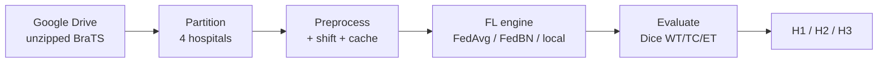

# Documentation index

Project docs, split by concern so each stays focused and maintainable. Suggested reading order top to bottom.

| # | Doc | Read it for |
|---|---|---|
| 1 | [methodology.md](methodology.md) | The research question, hypotheses (H1/H2/H3), methods compared, evaluation — the **why**. |
| 2 | [workflow.md](workflow.md) | **Start here to run it.** The four runs, the pipeline in order, measured costs, and the decision gates. |
| 3 | [data.md](data.md) | BraTS 2021 spec, labels/regions, and the reproducible data-acquisition pipeline. |
| 4 | [architecture.md](architecture.md) | System components, end-to-end data/training flow, module layout, logging strategy — the **big picture**. |
| 5 | [data-pipeline.md](data-pipeline.md) | Case → hospital partition, synthetic scanner shift, preprocessing, caching, sampling — the **data engineering**. |
| 6 | [federated-learning.md](federated-learning.md) | The FL round loop and how FedAvg / FedBN / local-only aggregate — the **training engine**. |
| 7 | [experiments.md](experiments.md) | Experiment matrix, evaluation protocol, and exactly how each hypothesis is measured. |
| 8 | [specs.md](specs.md) | Reference sheet — hyperparameters, model dims, hardware numbers, seeds, artifact/log layout. |
| 9 | [environments.md](environments.md) | Windows / WSL2 / Colab — what runs where, the portability contract, run recipes. |
| 10 | [progress-log.md](progress-log.md) | Dated lab notebook — decisions and milestones with rationale. |

## One-screen orientation

- **Goal:** show personalized FL (FedBN) recovers the outlier hospital that a single global model (FedAvg) serves worst, without hurting the average — vs. a local-only floor and a centralized ceiling.
- **Data:** BraTS 2021, 1251 3D MRI cases, split into **4 simulated hospitals** (3 typical + 1 outlier via a synthetic scanner shift).
- **Models:** 2D and 3D U-Net (dimension-parametric); 2D first, 3D feasibility-gated.
- **Compute:** local RTX 3050 (4 GB) for prep + quick checks; Colab T4 (16 GB) for training.

## Diagram conventions

Diagrams are [Mermaid](https://mermaid.js.org/) fenced blocks — they render inline on GitHub. Colour meaning is kept consistent with the concept explainer: **global** model = the method under test, **base** = ceiling, **local** = floor.
