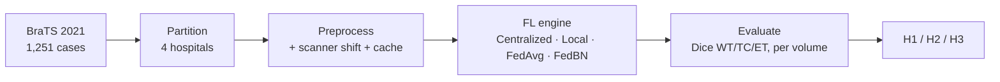

# Documentation

Four reference documents, plus a travel-friendly walkthrough.

| Doc | Read it for |
|---|---|
| **[conventions.md](conventions.md)** | **Read first.** Naming rules (hospitals = Site A–D, hypotheses = H1–H3), reporting rules, and every retracted claim. |
| **[data.md](data.md)** | The dataset, the four-hospital partition, the synthetic scanner shift, preprocessing, sampling and the cache. |
| **[training.md](training.md)** | The research question, the four methods, the federated round loop, the evaluation protocol, and the full v1→v5 record with all results. |
| **[code.md](code.md)** | How to run it, what every module does, how one run flows through the code, and what changed in the code across the iterations. |
| **[travel-walkthrough.md](travel-walkthrough.md)** | A single presentation and viva briefing: narrative, final numbers, safe wording, limitations, questions, and demo checklist. |

## Supporting material

| Folder | Contents |
|---|---|
| **[results/](results/)** | Generated per-run reports — comparisons, significance tests, inference-only measurements. Written by `compare_runs.py` and `compute_significance.py`; not hand-maintained. |
| **[archive/](archive/)** | Superseded and merged documents, kept for reference. Nothing here is current. |

## One-screen orientation


```mermaid
flowchart LR
    D["BraTS 2021<br/>1,251 cases"] --> P["Partition<br/>4 hospitals"]
    P --> PP["Preprocess<br/>+ scanner shift + cache"]
    PP --> FL["FL engine<br/>Centralized · Local · FedAvg · FedBN"]
    FL --> E["Evaluate<br/>Dice WT/TC/ET, per volume"]
    E --> R["H1 / H2 / H3"]
```

- **Goal:** show that personalized FL (FedBN) recovers the outlier hospital a single global model
  (FedAvg) serves worst, without hurting the average — against a local-only floor and a
  centralized ceiling.
- **Data:** BraTS 2021, 1,251 3D MRI cases, split into **4 simulated hospitals** (3 typical + 1
  outlier via a synthetic scanner shift).
- **Models:** dimension-parametric U-Net, run in both 2D and 3D.
- **Evidence:** 248 held-out volumes, a pre-registered estimator, paired per-case statistics, and
  five frozen hash-verified iterations.

## Keeping it honest

```bash
uv run python scripts/check_docs.py
```

Re-derives sixteen headline Dice figures from `artifacts/snapshots/`, checks every document against
[conventions.md](conventions.md), verifies every relative link resolves, confirms each iteration is
archived with a manifest, and fails if the [review pack](../review/) is older than any document it
copied. **Run it before committing documentation changes.**

## Presenting

```bash
uv run python scripts/build_review_pack.py     # review/ — one folder to present from
uv run python scripts/demo_server.py           # / live demo · /showcase the walkthrough
```

## Diagram conventions

Diagrams are [Mermaid](https://mermaid.js.org/) fenced blocks and render inline on GitHub.
