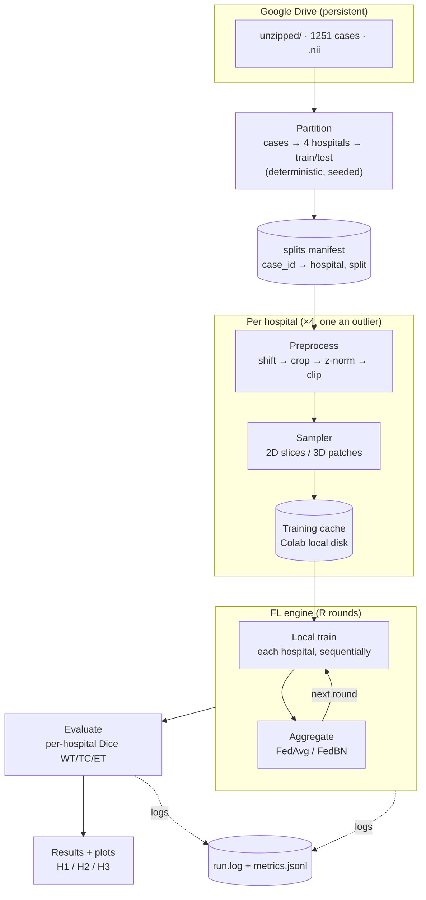
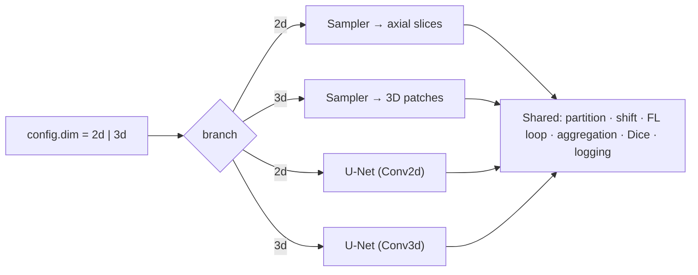
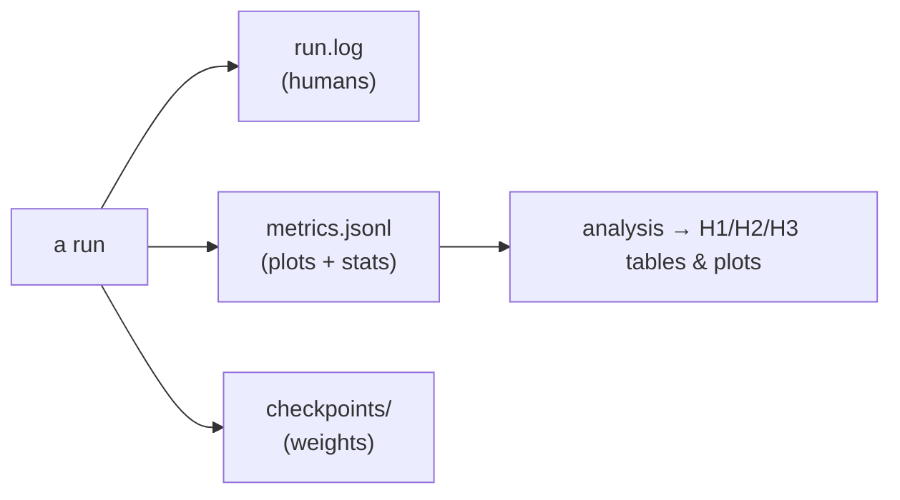

# Architecture

How the pieces fit together, end to end, and where the code lives.

## 1. System overview

Everything flows from the unzipped data in Google Drive to a set of per-hospital Dice scores that
test H1/H2/H3. The same machinery serves both the 2D and 3D backbones via a single `dim` flag.



## 2. Components

| Component | Responsibility | Doc |
|---|---|---|
| **Partition** | Deterministically assign 1251 cases → 4 hospitals → train/test; write a manifest. | [data-pipeline](data-pipeline.md) |
| **Shift** | Apply each hospital's fixed synthetic scanner transform (the non-IID source). | [data-pipeline](data-pipeline.md) |
| **Preprocess + Sampler** | Load, crop, normalize; emit 2D slices or 3D patches; cache once. | [data-pipeline](data-pipeline.md) |
| **Model** | 2D/3D U-Net with BatchNorm (BN is what FedBN keeps local). | [specs](specs.md) |
| **FL engine** | Round loop: local training + FedAvg/FedBN aggregation; also runs local-only and centralized. | [federated-learning](federated-learning.md) |
| **Metrics + Eval** | Dice on WT/TC/ET, per-hospital and averaged. | [experiments](experiments.md) |
| **Logging** | Console + `run.log` + machine-readable `metrics.jsonl` per run. | §5 below |

## 3. Dimension-parametric design (2D **and** 3D)

Only two components branch on `dim`; everything else is shared. This is what makes "build both" cheap.



## 4. Module layout

```
src/fedbrats/
  config.py          dataclasses: paths (per-platform), hospitals, hyperparameters, dim
  logging_utils.py   console + file logger, JSONL metrics writer
  partition.py       cases → hospitals → train/test  (writes the manifest)
  shift.py           per-hospital synthetic scanner shift
  data.py            load case · preprocess · cache (fp16 memmap) · 2D/3D samplers · Dataset
  model.py           BratsUNet (MONAI, 2D/3D via dim flag, BatchNorm) + bn_keys()
  metrics.py         per-volume Dice WT/TC/ET (BraTS empty-GT convention)
  train.py           one local training loop + full-volume evaluation
  federated.py       one round loop expressing all four methods + aggregation
scripts/
  build_partition.py run the partition, print + save the manifest
  build_cache.py     materialize the preprocessing cache (resumable, parallel)
  run_experiment.py  --method {centralized,local,fedavg,fedbn} --dim {2d,3d}
notebooks/
  colab_setup.ipynb  data acquisition (download → stream-unzip → Drive)
  colab_train.ipynb  thin driver: clone repo + run a scripts/ entrypoint on the T4
artifacts/           git-ignored run outputs + cache (see specs.md)
```

Every `scripts/` entrypoint carries an `if __name__ == "__main__":` guard — mandatory under
Windows `spawn`. See [environments.md](environments.md).

## 5. Logging & artifacts strategy

Logs are treated as first-class — a run should be reconstructable and analyzable after the fact.

- **Human log** — `artifacts/runs/<run_id>/run.log`: timestamped INFO lines (config echo, per-round
  progress, warnings). Mirrored to console.
- **Machine metrics** — `artifacts/runs/<run_id>/metrics.jsonl`: one JSON object per measurement
  (round × hospital × region), so plots and the H1/H2/H3 tests read straight from it. Schema in [specs](specs.md).
- **Manifests** — the partition (`artifacts/splits/partition.json`) is small and deterministic, so it is
  **committed**: every run references the same split, guaranteeing comparability.
- **Checkpoints** — model weights under the run dir (git-ignored; large).



## 6. Execution environments

| Env | Role | Notes |
|---|---|---|
| **Windows-native — RTX 3050 (4 GB)** | quick 2D checks, cache builds | fast `D:\`; **no FLARE** (POSIX-only `resource`) |
| **WSL2 — RTX 3050 (4 GB)** | dev, smoke runs, FLARE smoke | matches Colab (`fork`); `/mnt/d` is slow |
| **Colab — T4 (16 GB)** | full training, heavy 3D sweeps | data staged in Drive; cache built on local disk per session |

Because the FL loop runs clients **sequentially**, peak VRAM is one model's footprint regardless of the
number of hospitals — see [federated-learning](federated-learning.md) §4.

Full matrix, the Windows compatibility contract, and per-environment recipes:
[environments.md](environments.md).

## 7. Reproducibility

A single global **seed** drives the partition, shuffling, and weight init. Same seed + same committed
manifest ⇒ identical splits and comparable runs across methods and across the 2D/3D backbones.
