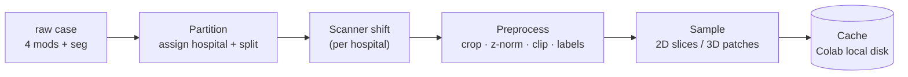
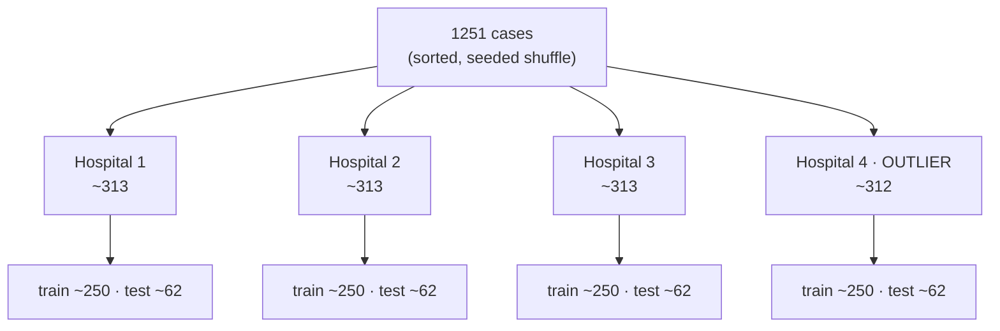
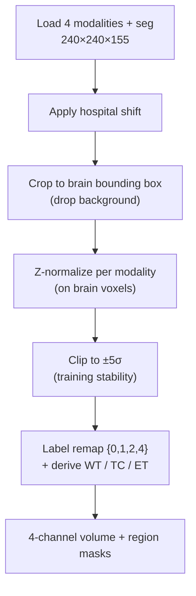

# Data pipeline

The journey from a raw case in Drive to a training batch. Four stages: **partition → shift →
preprocess → sample/cache**.

---

## 1. Partition — cases → 4 hospitals → train/test

We **partition first, then split each hospital into train/test**, so every hospital owns both a training
set *and* a test set drawn from its own (shifted) distribution — required for the per-hospital H2/H3 claims.

| | Hospital 1 | Hospital 2 | Hospital 3 | Hospital 4 (outlier) | Total |
|---|---|---|---|---|---|
| assigned | ~313 | ~313 | ~313 | ~312 | 1251 |
| → **train** | ~250 | ~250 | ~250 | ~250 | **~1000** |
| → **test** | ~62 | ~62 | ~62 | ~62 | **~251** |

- **Deterministic:** sort case IDs → shuffle with the global seed → assign → split. Reproducible.
- **`train_per_hospital` knob:** each round samples up to *N* train cases per hospital (start **120–150**)
  from its ~250, so the collaboration benefit (H1) stays visible; the test sets are fixed regardless.
- **Manifest:** the assignment is written once to `artifacts/splits/partition.json`
  (`case_id → {hospital, split, is_outlier}`) and **committed**, so every experiment uses the identical split.
- **Centralized base model** trains on the union of the four hospitals' train sets (~1000).

## 2. Scanner shift — the non-IID source

Each hospital applies a **fixed, hospital-specific** transform to emulate its scanner. It must be
**nonlinear / spatial**, or per-image z-normalization (stage 3) would erase a purely linear intensity
change and leave no real heterogeneity (a bug we hit before).

| Ingredient | Effect | Per-hospital |
|---|---|---|
| **Gamma** | nonlinear contrast (`x^γ`) | different γ per hospital |
| **Bias field** | smooth low-frequency intensity gradient across the volume | different field |
| **Gaussian blur** | mild resolution/PSF difference | different σ |

Hospitals 1–3 get mild, distinct settings; **Hospital 4 (outlier)** gets the strongest deviation to
drive H2/H3. Shift strength is a calibration knob (to be tuned so H2 is visible yet plausible). The
shift is applied to **both** a hospital's train and test cases.

## 3. Preprocess

- **Stack** the 4 modalities (FLAIR, T1, T1ce, T2) as input channels.
- **Crop** to the brain's bounding box — ~99% background is wasted compute.
- **Z-normalize** each modality on brain voxels (zero mean / unit std); **clip ±5σ** to tame outliers
  (a gamma-shift outlier once caused NaNs at ~14σ).
- **Labels:** raw `{0,1,2,4}` → derive the three evaluation regions
  **WT** = 1∪2∪4, **TC** = 1∪4, **ET** = 4. The model predicts 3 region channels.

## 4. Sample (2D vs 3D) + cache

The one place the `dim` flag changes the data:

| | **2D (`dim=2d`)** | **3D (`dim=3d`)** |
|---|---|---|
| Unit | axial slice, 240×240 (cropped) | patch, e.g. 96³ or 128³ |
| Selection | tumor-biased slice sampling | random/foreground-biased patches |
| Batch | 8–16 | 1–2 |

- **Cache once:** materialize the preprocessed, sampled tensors to Colab's local disk so training epochs
  read fast (no re-decode, no re-shift). Built from the working subset defined by the manifest + knob.
- **Fits Colab:** a subset cache (not the full 114 GB) is small enough for the ~100 GB local disk — this is
  why we never need the full unzipped set on Colab at once (see [data.md](data.md) §3).

## 5. Outputs of this stage

- `artifacts/splits/partition.json` — the committed split manifest.
- Per-hospital cache on Colab local disk — consumed by the [FL engine](federated-learning.md).
