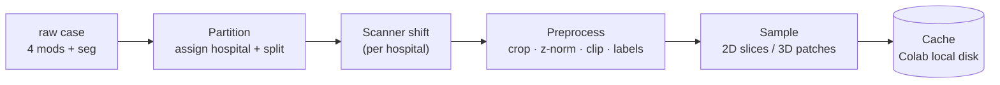
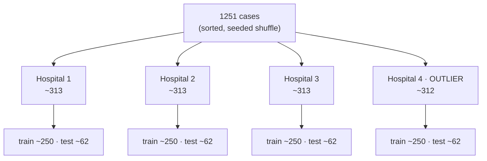
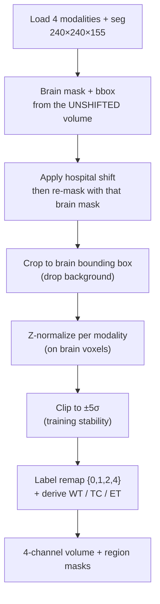

# Data pipeline

The journey from a raw case in Drive to a training batch. Four stages: **partition → shift →
preprocess → sample/cache**.

---

## 1. Partition — cases → 4 hospitals → train/test

We **partition first, then split each hospital into train/test**, so every hospital owns both a training
set *and* a test set drawn from its own (shifted) distribution — required for the per-hospital H2/H3 claims.

| | Hospital 1 | Hospital 2 | Hospital 3 | Hospital 4 (outlier) | Total |
|---|---|---|---|---|---|
| assigned | ~313 | ~313 | ~313 | ~312 | 1251 |
| → **train** | ~250 | ~250 | ~250 | ~250 | **~1000** |
| → **test** | ~62 | ~62 | ~62 | ~62 | **~251** |

- **Deterministic:** sort case IDs → shuffle with the global seed → assign → split. Reproducible.
- **`train_per_hospital` knob:** each round samples up to *N* train cases per hospital (start **120–150**)
  from its ~250, so the collaboration benefit (H1) stays visible; the test sets are fixed regardless.
- **Manifest:** the assignment is written once to `artifacts/splits/partition.json`
  (`case_id → {hospital, split, is_outlier}`) and **committed**, so every experiment uses the identical split.
- **Centralized base model** trains on the union of the four hospitals' train sets (~1000).

## 2. Scanner shift — the non-IID source

Each hospital applies a **fixed, hospital-specific** transform to emulate its scanner. It must be
**nonlinear / spatial**, or per-image z-normalization (stage 3) would erase a purely linear intensity
change and leave no real heterogeneity (a bug we hit before).

| Ingredient | Effect | Per-hospital |
|---|---|---|
| **Gamma** | nonlinear contrast (`x^γ`) | different γ per hospital |
| **Bias field** | smooth low-frequency intensity gradient across the volume | different field |
| **Gaussian blur** | mild resolution/PSF difference | different σ |

Hospitals 1–3 get mild, **same-direction** settings (so they cluster); **Hospital 4 (outlier)** gets
the strongest deviation to drive H2/H3. The shift is applied to **both** a hospital's train and test cases.

Starting (calibrated) parameters — `src/fedbrats/shift.py`:

| Hospital | gamma | bias amp | blur σ |
|---|---|---|---|
| H1 | 1.06 | 0.06 | 0.3 |
| H2 | 1.13 | 0.09 | 0.5 |
| H3 | 1.20 | 0.12 | 0.7 |
| **H4 (outlier)** | **1.85** | **0.34** | **1.7** |

Verified on a real case: after z-normalization the hospitals still differ (pairwise mean abs. diff
0.10–0.38 σ), H4 is the clear outlier (**margin +0.149 σ** over the most-distant typical hospital), and
a purely *linear* shift washes out to **0.000** (confirming the shift must be nonlinear). The strength is
a single knob — the real calibration is whether **H2** appears once we train; revisit then.

## 3. Preprocess

- **Stack** the 4 modalities (FLAIR, T1, T1ce, T2) as input channels.
- **Brain mask and bbox come from the *unshifted* volume**, and the shifted volume is re-masked with
  them. This is load-bearing — see the box below.
- **Crop** to the brain's bounding box — ~99% background is wasted compute.
- **Z-normalize** each modality on brain voxels (zero mean / unit std); **clip ±5σ** to tame outliers
  (a gamma-shift outlier once caused NaNs at ~14σ).
- **Labels:** raw `{0,1,2,4}` → derive the three evaluation regions
  **WT** = 1∪2∪4, **TC** = 1∪4, **ET** = 4. The model predicts 3 region channels.

> ### ⚠ The blur-halo trap (fixed)
>
> The shift's Gaussian blur smears brain intensity into BraTS's exactly-zero skull-stripped
> background. If the brain mask is derived *after* the shift (`vol.sum(0) > 0`), it grows with the
> hospital's blur σ:
>
> | | H1 (σ=0.3) | H2 (σ=0.5) | H3 (σ=0.7) | **H4 (σ=1.7)** |
> |---|---|---|---|---|
> | leaked background voxels | +112,726 | +226,623 | +342,450 | **+833,379 (+57%)** |
>
> Three consequences: the crop bbox becomes hospital-dependent (volumes get *different shapes*),
> z-norm statistics are computed over the halo, and — worst — **hospital identity leaks as geometry**,
> so a FedBN "recovery" of H4 could be an artifact rather than scanner adaptation.
>
> Fix: take the mask/bbox from the unshifted volume, then `apply_shift(mods, h) * mask`. Verified:
> all four hospitals then share one shape, pairwise post-z-norm differences land at 0.095–0.388 σ,
> H4's outlier margin is +0.149 σ, and a purely linear shift still washes out to 0.0000.

## 4. Sample (2D vs 3D) + cache

The one place the `dim` flag changes the data:

| | **2D (`dim=2d`)** | **3D (`dim=3d`)** |
|---|---|---|
| Unit | axial slice, 240×240 (cropped) | patch, e.g. 96³ or 128³ |
| Selection | tumor-biased slice sampling | random/foreground-biased patches |
| Batch | 8–16 | 1–2 |

- **Cache once:** materialize the preprocessed **volumes** (not pre-sampled units) so training epochs
  read fast — no re-decode, no re-shift. Preprocessing is ~6 s/case; a full run would otherwise redo
  it every epoch of every round of every method.
- **Sample at load time** from the memory-mapped volume: 2D draws a tumour-biased axial slice, 3D
  draws a foreground-biased patch. Caching volumes rather than slices means one cache serves *both*
  backbones.
- **Tumour bias is a mix, not a filter.** `tumor_frac = 0.7`: training on tumour-bearing slices *only*
  makes the model hallucinate tumour on the empty slices it meets during full-volume evaluation.
- **Invalidation:** the cache directory is keyed by an md5 of the shift parameters + clip + seed, so
  changing the scanner shift builds a fresh cache instead of silently reusing stale tensors.
- **Resumable:** a case with a `meta.json` is skipped, so a killed build (or a dropped Colab session)
  picks up where it left off.

Layout — `<cache>/<key>/<case_id>/{x.npy, y.npy, meta.json}` plus an assembled `index.json`;
`x` is `(4,X,Y,Z)` float16, `y` is `(3,X,Y,Z)` uint8.

**Measured: ~35 MB/case** → ~44 GB for all 1251. See [environments.md](environments.md) for where that
may and may not live.

## 5. Outputs of this stage

- `artifacts/splits/partition.json` — the committed split manifest.
- Per-hospital cache (Colab local disk / `D:`) — consumed by the [FL engine](federated-learning.md).
