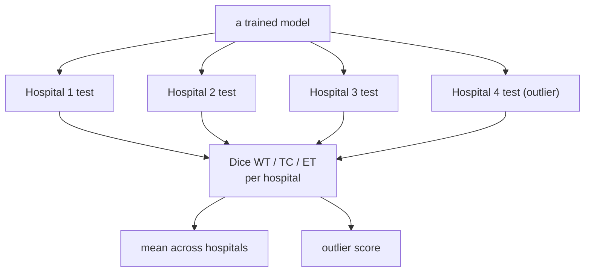

# Experiments

The operational plan: what runs, how they're evaluated, and exactly how each hypothesis is measured.

## 1. Experiment matrix

Run for the **2D** backbone first; repeat for **3D** if the feasibility spike passes.

| # | Run | Trains on | Produces |
|---|---|---|---|
| E0 | **Centralized** | pooled ~1000 train | ceiling reference |
| E1 | **Local-only** ×4 | each hospital's own train | floor (one model per hospital) |
| E2 | **FedAvg** | federated across 4 hospitals | global model (H1, H2) |
| E3 | **FedBN** | federated, BN kept local | personalized model (H3) |

All four share the **same committed split**, the same seed, and the same test sets — only the training
*procedure* differs, so the comparison is clean.

## 2. Evaluation protocol

- **Metric:** Dice on the three regions **WT** (whole tumor), **TC** (tumor core), **ET** (enhancing).
- **Per volume, never per slice.** For 2D we predict every axial slice, stack them into a volume, and
  score *that*. The mean of per-slice Dice is not the per-case Dice — it inflates scores, because
  empty slices score 1.0 for free.
- **Empty ground truth (matters for ET).** BraTS convention: empty prediction on empty GT scores 1.0;
  any false positive scores 0.0. Without this the ET column is meaningless.
- **Two views:** per-hospital Dice (for the outlier claims) and the mean across hospitals (for the average
  claims). Reported per method.
- **FedBN eval:** each hospital uses the shared weights + *its own* BN layers.
- **Timing:** score **after aggregation, before the next round's local training** — see
  [federated-learning](federated-learning.md).
- Every score is appended to `metrics.jsonl`; tables/plots are generated from that file.

### Scope — diagonal, plus a cross-matrix for local-only

The headline numbers are the **diagonal**: each hospital's model on its own test set
(`model_hospital == test_hospital`). That is all H1/H2/H3 require.

Additionally, at the **final round only**, every local-only model is scored on all four test sets — a
4×4 matrix. Its off-diagonal cells are direct evidence the synthetic shift creates a genuine domain
gap (H4's model should collapse on H1–H3). It is run once rather than per round, since it costs 16×
a diagonal evaluation.

## 3. How each hypothesis is measured

| Hyp. | Claim | Concrete test |
|---|---|---|
| **H1** | collaboration helps on average | `mean_dice(FedAvg) ≥ mean_dice(Local-only)` |
| **H2** | the global model fails the outlier | `dice(FedAvg, H4) < dice(Local-only, H4)` |
| **H3** | personalization recovers the outlier | `mean_dice(FedBN) ≥ mean_dice(FedAvg)` **and** `dice(FedBN, H4) ≥ dice(FedAvg, H4)` (closing the H2 gap) |

Centralized (E0) frames all of the above as "how close to the pooled ceiling did we get."

> **Matched compute — what makes H1 a real test.** FedAvg gives each hospital `R × E` local epochs.
> Local-only therefore also trains `R × E` epochs, so the *only* difference between them is
> aggregation. Had local-only trained for `E` epochs, H1 would be near-guaranteed and would merely be
> measuring FedAvg's ~R× larger training budget. Centralized likewise trains `R × E` epochs on the
> pooled set.

> **Identical init.** All four methods start from the same seeded random weights (`build_model` seeds
> `torch` before construction), so no comparison is confounded by initialization luck.

## 4. Results — 2D backbone (R=25, E=1, seed 42, 150 train/hospital)

Run on the RTX 3050; `metrics.jsonl` per run under `artifacts/runs/`. Regenerate the verdicts with
`python scripts/analyze.py --dim 2d` and the figures with `python scripts/plot_results.py`.

### Mean Dice across hospitals (diagonal)

| Method | WT | TC | ET |
|---|---|---|---|
| Centralized (ceiling) | 0.852 | 0.835 | 0.794 |
| Local-only (floor) | 0.853 | 0.831 | 0.787 |
| FedAvg | 0.835 | 0.817 | 0.764 |
| FedBN | 0.852 | 0.828 | 0.779 |

### Per-hospital WT Dice (outlier = H4)

| Method | H1 | H2 | H3 | H4 (outlier) |
|---|---|---|---|---|
| Local-only | 0.848 | 0.863 | 0.842 | **0.857** |
| FedAvg | **0.883** | **0.884** | 0.838 | **0.737** |
| FedBN | 0.866 | 0.866 | 0.849 | **0.829** |

### Verdicts

| Hyp. | Test | Observed (WT) | Verdict |
|---|---|---|---|
| **H1** | mean(FedAvg) ≥ mean(Local) | 0.835 vs 0.853 | **not supported** |
| **H2** | dice(FedAvg, H4) < dice(Local, H4) | 0.737 vs 0.857 | **supported** |
| **H3** | mean(FedBN) ≥ mean(FedAvg) **and** dice(FedBN,H4) ≥ dice(FedAvg,H4) | 0.852 ≥ 0.835 and 0.829 ≥ 0.737 | **supported** |

**Reading of the result.** FedAvg *improves* the three typical hospitals over local-only
(H1 0.848→0.883, H2 0.863→0.884) — collaboration helps where scanners are alike — but **collapses on
the outlier** (H4 0.857→0.737). That single collapse drags the mean below local-only, so H1 fails *as
stated*, not because federation is useless but because one compromise global model cannot serve both
the cluster and the outlier. That is precisely the gap FedBN closes: keeping BatchNorm local **recovers
H4 (0.737→0.829)** while retaining the collaboration gains on the cluster, landing a mean (0.852) that
ties local-only and the centralized ceiling and beats FedAvg — **without pooling any data**. The
cross-hospital matrix corroborates the domain gap: the H1 model scores only 0.671 on H4, its worst cell.

Figures: `artifacts/figures/{learning_curves_wt_2d,per_hospital_wt_2d,outlier_h4_wt_2d}.png`.
## 5. Results — 3D backbone (R=25, E=1, seed 42, 150 train/hospital)

### Mean Dice across hospitals (diagonal)

| Method | WT | TC | ET |
|---|---|---|---|
| Centralized (ceiling) | 0.880 | 0.836 | 0.793 |
| Local-only (floor) | 0.852 | 0.778 | 0.751 |
| FedAvg | 0.859 | 0.801 | 0.770 |
| FedBN | 0.834 | 0.781 | 0.746 |

### Per-hospital WT Dice (outlier = H4)

| Method | H1 | H2 | H3 | H4 (outlier) |
|---|---|---|---|---|
| Local-only | 0.871 | 0.872 | 0.844 | **0.819** |
| FedAvg | 0.862 | 0.866 | 0.859 | **0.848** |
| FedBN | 0.844 | 0.863 | 0.797 | **0.833** |

### Verdicts (3D)

| Hyp. | Test | Observed (WT) | Verdict |
|---|---|---|---|
| **H1** | mean(FedAvg) ≥ mean(Local) | 0.859 vs 0.852 | **supported** |
| **H2** | dice(FedAvg, H4) < dice(Local, H4) | 0.848 vs 0.819 | **not supported** |
| **H3** | mean(FedBN) ≥ mean(FedAvg) **and** dice(FedBN,H4) ≥ dice(FedAvg,H4) | 0.834 ≥ 0.859 and 0.833 ≥ 0.848 | **not supported** |

**Reading of the 3D result.** Unlike 2D, the 3D backbone results show that **FedAvg does not fail the outlier** (H2 is not supported). On the outlier (H4), FedAvg (0.848) outperforms local-only (0.819) by a wide margin, and FedAvg beats local-only on average (0.859 vs 0.852, supporting H1). Consequently, local personalization via FedBN is counterproductive (mean WT 0.834 vs FedAvg 0.859).

This divergence is explained by two factors:
1. **Data scarcity & overfitting in 3D:** Training a 3D model with only 150 local cases (batch size 1) is highly prone to overfitting. The collaborative pooling in FedAvg provides a strong regularizing effect that greatly improves performance across all clients, including the outlier.
2. **Poor local BN estimation:** Keeping BatchNorm layers local (FedBN) requires clients to estimate running statistics on small local datasets. In 3D, 150 samples are insufficient to robustly estimate these statistics, causing local BN layers to degenerate and degrade overall model performance.

Figures: `artifacts/figures/{learning_curves_wt_3d,per_hospital_wt_3d,outlier_h4_wt_3d}.png`.

## 6. 3D feasibility spike (gate before E0–E3 in 3D)

Before running the full 3D matrix, one measurement decides go/no-go:

- Train a single 3D U-Net on the T4; record VRAM, per-epoch time, and projected full-study wall-clock vs.
  Colab's session limit.
- **Pass →** run E0–E3 in 3D and add a "does the story hold in 3D?" comparison.
- **Fail →** report the spike numbers; 2D remains the deliverable.

Local probe (RTX 3050) already shows 3D *fits in memory* at 96³/128³; the spike is about *speed at scale*.
See [specs](specs.md) for the measured numbers.
