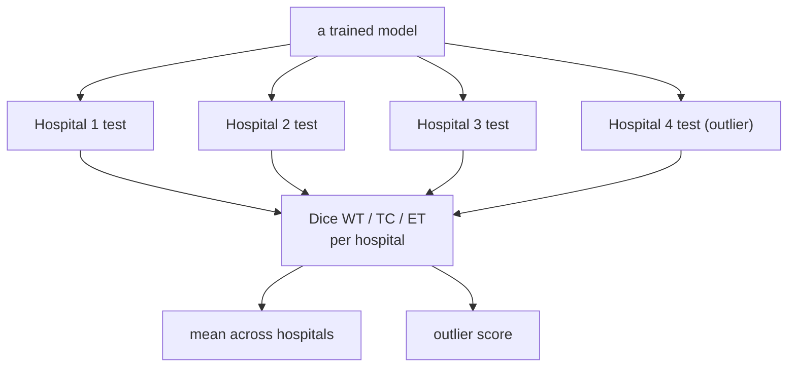

# Experiments

The operational plan: what runs, how they're evaluated, and exactly how each hypothesis is measured.

## 1. Experiment matrix

Run for the **2D** backbone first; repeat for **3D** if the feasibility spike passes.

| # | Run | Trains on | Produces |
|---|---|---|---|
| E0 | **Centralized** | pooled ~1000 train | ceiling reference |
| E1 | **Local-only** ×4 | each hospital's own train | floor (one model per hospital) |
| E2 | **FedAvg** | federated across 4 hospitals | global model (H1, H2) |
| E3 | **FedBN** | federated, BN kept local | personalized model (H3) |

All four share the **same committed split**, the same seed, and the same test sets — only the training
*procedure* differs, so the comparison is clean.

## 2. Evaluation protocol

- **Metric:** Dice on the three regions **WT** (whole tumor), **TC** (tumor core), **ET** (enhancing).
- **Two views:** per-hospital Dice (for the outlier claims) and the mean across hospitals (for the average
  claims). Reported per method.
- **FedBN eval:** each hospital uses the shared weights + *its own* BN layers.
- Every score is appended to `metrics.jsonl`; tables/plots are generated from that file.

## 3. How each hypothesis is measured

| Hyp. | Claim | Concrete test |
|---|---|---|
| **H1** | collaboration helps on average | `mean_dice(FedAvg) ≥ mean_dice(Local-only)` |
| **H2** | the global model fails the outlier | `dice(FedAvg, H4) < dice(Local-only, H4)` |
| **H3** | personalization recovers the outlier | `mean_dice(FedBN) ≥ mean_dice(FedAvg)` **and** `dice(FedBN, H4) ≥ dice(FedAvg, H4)` (closing the H2 gap) |

Centralized (E0) frames all of the above as "how close to the pooled ceiling did we get."

## 4. Results (to be filled)

### 2D backbone — mean Dice across hospitals

| Method | WT | TC | ET |
|---|---|---|---|
| Centralized (ceiling) | – | – | – |
| Local-only | – | – | – |
| FedAvg | – | – | – |
| FedBN | – | – | – |

### 2D backbone — per-hospital WT Dice (outlier = H4)

| Method | H1 | H2 | H3 | H4 (outlier) |
|---|---|---|---|---|
| Local-only | – | – | – | – |
| FedAvg | – | – | – | – |
| FedBN | – | – | – | – |

*(3D tables added if the feasibility spike passes.)*

## 5. 3D feasibility spike (gate before E0–E3 in 3D)

Before running the full 3D matrix, one measurement decides go/no-go:

- Train a single 3D U-Net on the T4; record VRAM, per-epoch time, and projected full-study wall-clock vs.
  Colab's session limit.
- **Pass →** run E0–E3 in 3D and add a "does the story hold in 3D?" comparison.
- **Fail →** report the spike numbers; 2D remains the deliverable.

Local probe (RTX 3050) already shows 3D *fits in memory* at 96³/128³; the spike is about *speed at scale*.
See [specs](specs.md) for the measured numbers.
