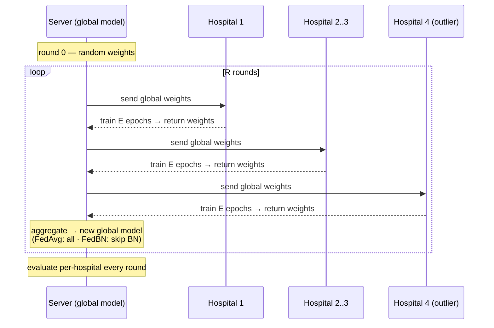
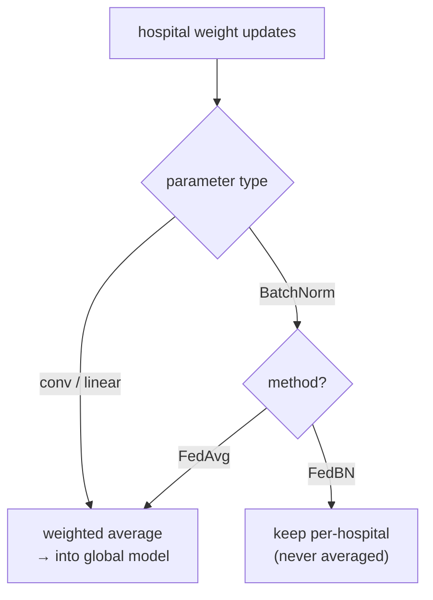
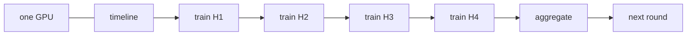

# Federated learning engine

How the global model is trained, and how the three methods differ. Conceptual background (why random
weights learn, why averaging works) is in [methodology](methodology.md); this doc is the *implementation design*.

## 1. Methods

| Method | What is shared / kept local | Role |
|---|---|---|
| **Centralized** | not federated — one model on pooled data | ceiling reference |
| **Local-only** ×4 | nothing shared; each hospital trains alone | floor |
| **FedAvg** | **all** weights averaged each round | global-model baseline (H1, H2) |
| **FedBN** | all weights averaged **except BatchNorm**, kept per-hospital | personalization under test (H3) |

## 2. The round loop

One communication round: the server sends the current global weights out, each hospital trains locally
on its own (shifted) data, returns its weights, and the server aggregates. Clients run **sequentially**
on the one GPU.



## 3. Aggregation — FedAvg vs FedBN

The **only** difference between FedAvg and FedBN is which parameters get averaged. FedBN leaves each
hospital's BatchNorm layers (running mean/var + affine γ/β) untouched, so every hospital normalizes to
its own scanner statistics while still sharing the convolutional filters.



- **Weighting:** average is weighted by each hospital's number of training samples (standard FedAvg).
- **FedBN identification:** parameters whose name matches the BatchNorm layers (running_mean,
  running_var, and the BN weight/bias) are excluded from the average and restored per hospital.
- **Evaluation under FedBN:** each hospital is evaluated with the shared weights + *its own* BN — that is
  the personalized model for that site.

## 4. Sequential execution & memory



- Clients execute **one at a time**, reusing the GPU → peak VRAM = **one** model, independent of the
  number of hospitals. This is why 4 hospitals cost no more GPU memory than 3.
- Total time ≈ constant in K when the *training pool is fixed* (more hospitals = thinner slices of the
  same data); it grows only if `train_per_hospital` is held fixed instead.

## 5. Pseudocode

```text
global_w = init_random(seed)
for r in 1..R:
    updates = []
    for h in hospitals:                 # sequential, shared GPU
        local_w = train(global_w, cache[h], epochs=E)   # same loop as centralized
        updates.append((local_w, n_samples[h]))
    if method == "fedavg":
        global_w = weighted_average(updates)
    elif method == "fedbn":
        global_w = weighted_average(updates, skip=batchnorm_keys)
        keep bn[h] = batchnorm_params(local_w[h])  for each h
    evaluate(global_w [+ bn[h] if fedbn], test[h]) for each h   # → metrics.jsonl

# local-only baseline: same train() per hospital, but NO aggregation (each keeps its own full model)
```

## 6. Why FedBN is the hypothesis

Under a scanner shift, the dominant mismatch between hospitals is in the **feature statistics** BatchNorm
captures. Averaging BN across hospitals (FedAvg) forces one compromise normalization that fits the
outlier worst. Keeping BN local (FedBN) lets the outlier normalize to itself while still benefiting from
the shared filters — the mechanism behind **H3** (recover the outlier without hurting the average).
