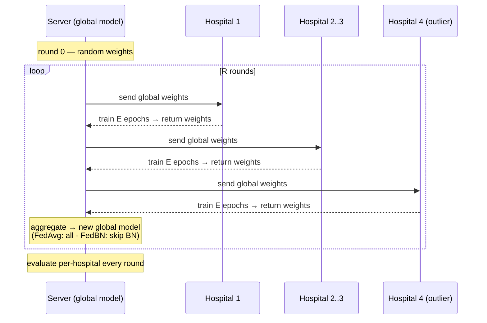
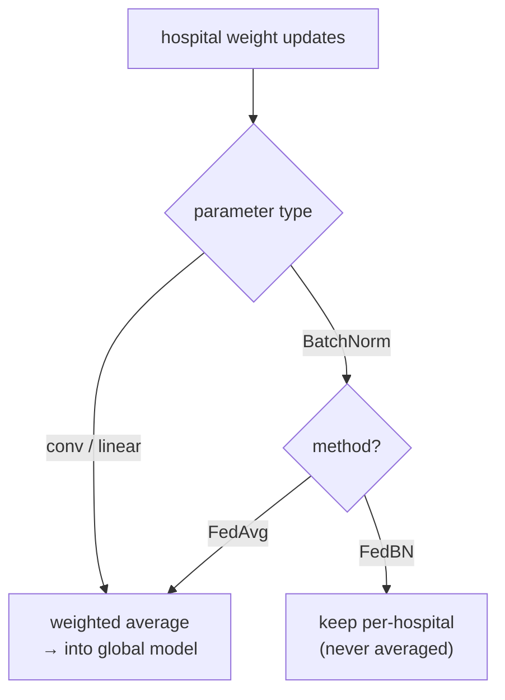
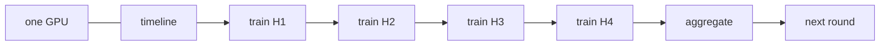

# Federated learning engine

How the global model is trained, and how the three methods differ. Conceptual background (why random
weights learn, why averaging works) is in [methodology](methodology.md); this doc is the *implementation design*.

## 0. Implementation approach — custom loop now, FLARE later

We implement the FL engine in **two phases**:

1. **Custom PyTorch round-loop (first).** ~200 lines, clients run sequentially on one GPU, fully
   transparent — used to produce and validate the H1/H2/H3 results. Everything below describes this loop.
2. **NVIDIA FLARE port (later, optional).** Once the science is validated, wrap the same FedAvg/FedBN
   aggregation in FLARE as an industry-framework demonstration. The aggregation *math* is identical, so
   the results should carry over; FLARE just changes the orchestration.

The data pipeline and model are unchanged by this choice — both engines consume the same cached tensors.

## 1. Methods

| Method | What is shared / kept local | Role |
|---|---|---|
| **Centralized** | not federated — one model on pooled data | ceiling reference |
| **Local-only** ×4 | nothing shared; each hospital trains alone | floor |
| **FedAvg** | **all** weights averaged each round | global-model baseline (H1, H2) |
| **FedBN** | all weights averaged **except BatchNorm**, kept per-hospital | personalization under test (H3) |

## 2. The round loop

One communication round: the server sends the current global weights out, each hospital trains locally
on its own (shifted) data, returns its weights, and the server aggregates. Clients run **sequentially**
on the one GPU.



## 3. Aggregation — FedAvg vs FedBN

The **only** difference between FedAvg and FedBN is which parameters get averaged. FedBN leaves each
hospital's BatchNorm layers (running mean/var + affine γ/β) untouched, so every hospital normalizes to
its own scanner statistics while still sharing the convolutional filters.



- **Weighting:** average is weighted by each hospital's number of training samples (standard FedAvg).
- **Evaluation under FedBN:** each hospital is evaluated with the shared weights + *its own* BN — that is
  the personalized model for that site.

### Three implementation traps

1. **State is `state_dict()`, not `parameters()`.** BN running statistics are *buffers*;
   `model.parameters()` excludes them. They are the entire mechanism of FedBN. Miss them and FedBN
   silently degrades to FedAvg.
2. **`num_batches_tracked` is `int64`.** Every BN layer carries one. A weighted mean turns it into a
   float and `load_state_dict` rejects or corrupts it. Integer buffers are **copied from the
   highest-weighted client**, never averaged.
3. **Identify BN keys by module *type*, not by name.** MONAI emits keys like
   `net.model.0.conv.unit0.adn.N.bias` — there is no `"bn"` substring to match. We walk
   `named_modules()` for `nn.modules.batchnorm._BatchNorm`. (65 of the U-Net's 114 state keys are BN.)

### When to evaluate — after aggregation, before local training

Evaluation scores the **true federated model**: pure global for FedAvg, global body + own BN for
FedBN. If instead you score *after* a round of local training, FedAvg quietly gains a round of local
adaptation — which is precisely the personalization H2 claims it lacks. H2 would vanish for a purely
procedural reason. Order is therefore fixed: `train → aggregate → evaluate → next round`.

> In the custom loop, per-hospital BN lives in an in-memory `bn_state` dict. Under FLARE it must be
> **persisted to disk** — FLARE may re-run the client script each round, resetting BN and collapsing
> FedBN into FedAvg (this bit us once: commit `0a85894`). One more reason to validate the science on
> the custom loop first.

## 4. Sequential execution & memory



- Clients execute **one at a time**, reusing the GPU → peak VRAM = **one** model, independent of the
  number of hospitals. This is why 4 hospitals cost no more GPU memory than 3.
- Total time ≈ constant in K when the *training pool is fixed* (more hospitals = thinner slices of the
  same data); it grows only if `train_per_hospital` is held fixed instead.

## 5. One loop, four methods

All four methods are the same round loop with two switches. This is why `federated.py` has no
per-method branches beyond a table:

| method | `aggregate` | `keep_bn_local` | `pooled` | role |
|---|---|---|---|---|
| `centralized` | no | – | **yes** | ceiling |
| `local` | no | – | no | floor |
| `fedavg` | **yes** | no | no | global model (H1, H2) |
| `fedbn` | **yes** | **yes** | no | personalized (H3) |

```text
global_w = init_random(seed)            # identical init for every method
for r in 1..R:
    for h in hospitals:                 # sequential, shared GPU
        w = global_w + bn[h]            # fedbn: own BN; fedavg: pure global
        updates[h] = train(w, cache[h], epochs=E)
    if aggregate:
        global_w.update(weighted_average(updates, n_samples, skip=bn_keys if fedbn else {}))
        if fedbn: bn[h] = batchnorm_state(updates[h])  for each h
    else:
        own_w = updates                 # local / centralized keep their own full model
    evaluate(global_w + bn[h], test[h]) for each h      # → metrics.jsonl
```

Two identities follow directly, and make cheap unit tests that need no training:

- **FedBN with K = 1 ≡ local-only** (aggregating one client, then restoring its own BN, is identity).
- **Averaging identical client states ≡ that state** (and dtypes, including `int64`, survive).

**Matched compute.** Local-only and centralized train for `R × E` epochs — the same total local
epochs a hospital spends across the whole federated run. Give local-only fewer and H1 ("collaboration
helps") merely measures FedAvg's longer training budget.

## 6. Why FedBN is the hypothesis

Under a scanner shift, the dominant mismatch between hospitals is in the **feature statistics** BatchNorm
captures. Averaging BN across hospitals (FedAvg) forces one compromise normalization that fits the
outlier worst. Keeping BN local (FedBN) lets the outlier normalize to itself while still benefiting from
the shared filters — the mechanism behind **H3** (recover the outlier without hurting the average).
