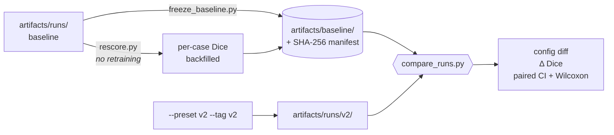

# Improving accuracy — and proving it

How the second round of results is produced and defended: what the baseline is, what changed,
and how "it got better" is turned into a claim with a number and a p-value attached.

Read [`workflow.md`](workflow.md) first for the run itself. This document is about the part that
comes after: comparing two runs honestly.

---

## 1. The finding that reframed the question

Before changing anything, the existing logs were re-scored. The models plateau by roughly round
15 and then oscillate — and the oscillation is **larger than the differences between the methods
being compared**.

Rounds 18–25, mean diagonal WT Dice, 2D seed 42:

| Method | r18 | r19 | r20 | r21 | r22 | r23 | r24 | r25 |
|---|---|---|---|---|---|---|---|---|
| fedavg | .8483 | .8377 | .8390 | .8608 | .8498 | .8437 | **.8611** | **.8354** |
| local | .8413 | .8543 | .8500 | .8469 | .8349 | .8343 | **.8491** | **.8526** |

At round 24 FedAvg beats local-only. At round 25 it loses. The reported verdict came from
whichever round the loop happened to stop on. `analyze.py` scores `max(round)`, so H1 was decided
by a coin flip — and the worst single swing in the 2D runs is 0.12 WT Dice (fedbn seed 123, H4:
0.794 averaged over the last five rounds, 0.676 at round 25 alone).

Re-scoring the **same frozen logs** with a mean over the last five rounds:

| | round 25 only | mean of rounds 21–25 |
|---|---|---|
| **H1** — fedavg ≥ local | **1/3 seeds** | **3/3 seeds** |
| **H2** — fedavg fails H4 | 3/3 | 3/3 |
| **H3** — fedbn ≥ fedavg, recovers H4 | 2/3 | 1/3 |

Nothing was retrained. Reproduce both rows:

```bash
python scripts/analyze.py --dim 2d --select last
python scripts/analyze.py --dim 2d --select last-k --last-k 5
```

Three things follow, and they matter more than any single Dice number:

1. **H1's original "NOT SUPPORTED" was not a result.** It was an unmeasured quantity. Under a
   noise-robust estimator, collaboration does beat going alone in every seed.
2. **H3 was over-claimed, and splitting it is the honest fix.** It bundles two claims. "FedBN
   recovers the outlier" is solid: FedBN scores H4 at ≈0.82 against FedAvg's ≈0.76 in all three
   seeds, under either estimator. "FedBN ≥ FedAvg on the mean" is inside the noise and should be
   reported as such rather than as a pass or a fail.
3. **Reducing this noise *is* the accuracy work.** A model that stops thrashing scores higher and
   is measured more precisely; the same change buys both.

The 3D runs were checked the same way and **all three 3D verdicts are identical under both
estimators** — the 3D reversal in [`methodology.md`](methodology.md#21-the-3d-reversal-finding)
does not depend on the estimator, which is worth stating explicitly since the 2D H1 verdict does.

---

## 2. What changed

Every default still reproduces the frozen baseline. Improvements are opt-in via `--preset v2`,
so "before" stays runnable after "after" exists.

| Lever | Baseline | v2 | Why |
|---|---|---|---|
| LR across rounds | constant 1e-3 | cosine → 5e-5 | A fresh Adam is built every round, so this is the *only* place a schedule can live. Constant LR is what makes the plateau oscillate. |
| Augmentation | **none** | flips, rot90, intensity jitter, noise | The baseline had no augmentation of any kind. |
| Test-time augmentation | none | flip-TTA on the final evaluation | Costs 4× inference once, no retraining, no risk. |
| Post-processing | none | drop components < 50 voxels | A 2D model predicts slices independently, so its false positives are small and z-isolated; real tumour is contiguous. |
| Validation set | **none** | 20 cases/hospital | Model selection had no signal to use except the test set or the clock. |
| Model selection | last round | best validation round | Removes exactly the coin flip in §1. |
| Per-case Dice | computed, **discarded** | written to `per_case.jsonl` | Without it there is no CI and no significance test. |

Two deliberate choices:

- **Validation comes from cases *after* the training cap, not carved out of it.** Holding out 20
  of the 150 would mean v2 trains on less data than the baseline, and a difference could no longer
  be attributed to the recipe. Cost: the cache must hold 170 cases/hospital instead of 150.
- **Augmentation restores the exact-zero background.** Preprocessing writes background as
  literally 0.0 and evaluation feeds volumes with that property; a shift or noise draw that lifts
  it off zero would train the model on inputs it never sees again.

---

## 2a. Measured already: the inference-only gain (no retraining)

Flip-TTA and component filtering change no weights, so they can be measured against the **frozen
baseline checkpoints** directly. Same models, same test volumes, two fields different
(`tta` False→True, `postproc_min_voxels` 0→50). 2D, seed 42, 248 paired volumes per method:

| Method | WT | TC | ET | Wilcoxon p (WT, all 248) |
|---|---|---|---|---|
| centralized | 0.8517 → 0.8595 (**+0.0078**) | +0.0034 | +0.0065 | 3.9e-29 |
| local-only | 0.8526 → 0.8596 (**+0.0070**) | +0.0097 | +0.0095 | 4.0e-24 |
| FedAvg | 0.8354 → 0.8388 (**+0.0034**) | +0.0100 | +0.0143 | 1.8e-16 |
| FedBN | 0.8525 → 0.8587 (**+0.0062**) | +0.0092 | +0.0138 | 2.2e-27 |

Every 95 % CI excludes zero; 199–222 of 248 volumes improve in each method. ET gains most, as
expected — component filtering removes exactly the small isolated false positives that a 2D model
scattered across slices, and ET is the smallest, most fragmented region.

Full report: [`results-inference-only.md`](results-inference-only.md). Reproduce:

```bash
python scripts/rescore.py --all --dim 2d --seed 42 --out-dir artifacts/baseline
python scripts/rescore.py --all --dim 2d --seed 42 --out-dir artifacts/rescore_tta \
    --tta --postproc-min-voxels 50
python scripts/compare_runs.py --baseline artifacts/baseline --new artifacts/rescore_tta \
    --dim 2d --seed 42 --select final
```

**One cell does not improve, and it is the interesting one.** FedAvg on H4 — the outlier — moves
−0.0009 (p = 0.54, the only non-significant cell in the table) while FedAvg gains on H1–H3 and
FedBN gains on H4. Better inference cannot rescue a model whose *representation* is mismatched to
the domain. That sharpens H2 rather than softening it: the outlier failure is a domain-shift
problem, not a decoding one, and TTA averaging over flips of a wrong answer still averages wrong
answers. It is also a useful negative control — a gain that appeared everywhere including there
would suggest the metric, not the method, had changed.

---

## 3. The protocol



### Why the freeze is not optional

`MetricsWriter` appends, and `run_id` is `<method>_<dim>_<seed>`. Re-running FedAvg 2D seed 42
would have written 25 fresh rounds *underneath* the 25 already in that file, and `analyze.py`,
which scores `max(round)`, would have silently averaged two experiments and reported the mean as
one. The failure leaves no error and no visible trace in the output.

Two things now prevent it: runs are namespaced by `--tag`, and `guard_run_dir` refuses to write
into a directory that already holds results.

```bash
python scripts/freeze_baseline.py            # snapshot + hash
python scripts/freeze_baseline.py --verify   # prove it hasn't drifted
```

### Backfilling the baseline's per-case numbers

Per-case Dice was computed and thrown away, so the frozen logs have means only. The checkpoints
survived, so the per-case numbers are recoverable **exactly** rather than approximately — no
retraining:

```bash
python scripts/rescore.py --all --dim 2d --seed 42 --out-dir artifacts/baseline
```

This doubles as a regression test on the evaluation path: with the new flags off, every rescored
mean reproduces the logged round-25 value to four decimals (fedavg H4 = 0.7373, fedbn H4 = 0.8290,
local H4 = 0.8569).

It writes `rescore_metrics.jsonl` and `rescore_config.json` — never `metrics.jsonl` or
`config.json`, which are hashed in the manifest. A tool that edits the frozen record to make a
comparison work has destroyed the thing the comparison was evidence for.

### Running and comparing

```bash
# extend the cache to cover the validation cases (resumable; only builds what's missing)
python scripts/build_cache.py --max-cases 170 --workers 8

python scripts/run_experiment.py --method centralized --dim 2d --preset v2 --tag v2
python scripts/run_experiment.py --method local       --dim 2d --preset v2 --tag v2
python scripts/run_experiment.py --method fedavg      --dim 2d --preset v2 --tag v2
python scripts/run_experiment.py --method fedbn       --dim 2d --preset v2 --tag v2

python scripts/compare_runs.py --dim 2d --select last-k --last-k 5 \
    --md-out docs/results-comparison.md --json-out artifacts/comparison_2d.json
```

---

## 4. What the comparison reports

**1. What changed** — a field-by-field diff of the two sides' recorded `config.json`. A results
table means nothing until a reader can see that one thing varied, and stated intentions are not
evidence; the runs' own configs are.

**2. By how much** — mean Dice per method and per hospital, before → after, with deltas.

**3. Whether it is real** — the same test volumes compared case by case: a paired bootstrap 95%
CI on the mean difference, and a Wilcoxon signed-rank test.

Paired, not two-sample, and that is the whole point. Hard cases are hard for both models, so
per-case variance is mostly case difficulty rather than model quality. Differencing within a case
removes it, which is why a 0.01 mean shift can be significant across 62 volumes while an unpaired
test on the same numbers would see nothing.

The tool applies **one estimator to both sides** and refuses to hide it when it cannot: if the
baseline has no `final` rows and the rerun does, it says so in the output rather than quietly
comparing a selected TTA model against a last-round one.

> **Reporting rule.** Choose the estimator before looking at the verdicts and apply it to both
> sides. `--select last-k --last-k 5` is the pre-registered choice for the rerun. It is defensible
> precisely because it was fixed in advance — the same freedom used after seeing results is how
> the 1/3-vs-3/3 split in §1 could be spun either way.

---

## 5. Honest limitations

- **Averaging the last K rounds reduces variance, it does not remove bias.** If a method is still
  improving at round 25, its 5-round mean understates it. The curves plateau by ~15, so this is
  minor here — but it is the reason to keep reporting the learning curves alongside the tables.
- **Validation changes the data layout.** v2 reads 170 cases/hospital where the baseline read 150.
  Training cases are identical; the cache is not. Anyone rebuilding from scratch needs the larger
  cache or `--val-per-hospital 0`.
- **TTA and post-processing are evaluated at final only.** Learning curves stay comparable to the
  baseline's, but the headline number and the curve's endpoint are measured differently. The
  `stage` field distinguishes them; do not read one as the other.
- **Three seeds is few.** "Supported in 3/3 seeds" is a stronger statement than 1/3, and still not
  a confidence interval over seeds. The per-case CIs are within a run, not across runs.
