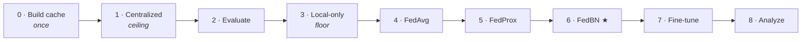
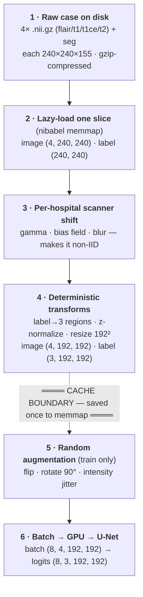
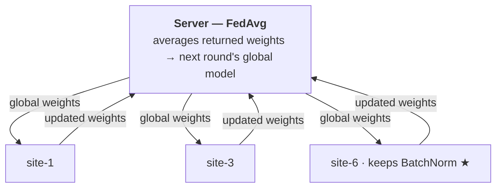

# Pipeline walkthrough — what the run does to the data

A narrated, diagram-first companion to [04 · Data pipeline](04-data-pipeline.md) and
[05 · Methods](05-methods.md). It follows a **single brain-MRI slice** from a
compressed file on disk all the way to a gradient step — through the per-hospital
scanner shift, the transforms, the **cache boundary**, and one round of federated
training.

> Diagrams below are [Mermaid](https://mermaid.js.org/) — they render on GitHub and
> in VS Code's Markdown preview. Colour cues used throughout: **data flow**,
> **per-hospital scanner shift**, **cache boundary (done once)**.

---

## 1 · The whole run — eight steps, one command

`run_all.sh` runs the entire experiment matrix. Every step trains or scores the
*same* U-Net on the *same* hospitals and val cases, so any Dice difference comes from
the **federation strategy**, not the model or the data split.



| Step | Script | What it produces |
|---|---|---|
| 0 | `fl/build_cache.py` | preprocess every slice once → memmap cache |
| 1 | `train_centralized` | the ceiling model, `data/centralized_unet.pt` |
| 2 | `fl/evaluate.py` | that model's per-hospital scores |
| 3 | `fl/run_local_baselines.py` | one model per hospital (the floor) |
| 4–6 | `fl/run_fedavg.py` | FedAvg / FedProx / **FedBN** per-hospital scores |
| 7 | `fl/finetune.py` | fine-tuned-per-hospital scores |
| 8 | `analyze.py` | `per_hospital.csv`, `summary.csv`, plots |

---

## 2 · The core — the journey of one 2D slice

This is "what the script does to the data." Each MRI case is a stack of 3-D volumes;
we never load them whole. We pull **one axial slice at a time** and push it through
the pipeline below. Everything **above the cache boundary is deterministic and saved
once**; everything below runs on every epoch.



### Shape at every stage

| Stage | image | label | notes |
|---|---|---|---|
| loaded slice | `(4, 240, 240)` | `(240, 240)` | 4 MRI sequences stacked; raw labels `{0,1,2,4}` |
| after shift | `(4, 240, 240)` | `(240, 240)` | intensities changed, shape unchanged |
| after transforms | `(4, 192, 192)` | `(3, 192, 192)` | labels → WT/TC/ET regions; z-normalized; resized |
| **cached here** | float16 memmap | uint8 memmap | this is what gets stored |
| after augment + batch | `(8, 4, 192, 192)` | `(8, 3, 192, 192)` | ready for the GPU |

### Why the shift must be non-linear (step 3)

Step 4 z-normalizes each channel over the brain voxels, which **erases any plain
brightness/contrast shift** (`a·x + b`). So the scanner shift uses **gamma** (reshapes
the histogram), a **bias field** (smooth spatial gain), and **blur** — differences
that *survive* normalization and therefore actually move the BatchNorm statistics that
FedBN specializes on. (Verified: an affine control → `0.0000` after normalization; the
real profiles survive.)

---

## 3 · Why the cache exists — the CPU work, done once

Loading + shifting + transforming a slice is CPU-heavy; the GPU step is tiny. Without
a cache, the *same* slice gets that treatment **hundreds of times** — every epoch of
every method re-does it.

```
Without cache:   each slice preprocessed  ≈ 235×   (per epoch × per method)
With cache:      each slice preprocessed     1×    → float16 memmap → read
```

`235×` = centralized (40 ep) + local (40 ep) + 3 × FL (50 rounds) + fine-tune, all
re-processing the same slices. Measured effect (scoped centralized step):

| metric | before (no cache) | with cache |
|---|---|---|
| epoch time | ~167 s | **~62 s** (~2.7× faster) |
| CPU used | ~12 cores pegged | **< 2 cores** |
| one-time build | — | ~4.5 GB (200 cases) / ~13.5 GB (600 cases) |

The cache is keyed by a hash of **(scanner profiles, image size, hospital
assignment)** — change any of them and it rebuilds automatically, so a stale cache can
never silently corrupt a result. Files live under `data/cache/<key>/`
(`img.dat`, `lbl.dat`, `manifest.json`) and are gitignored.

---

## 4 · Step 3 in detail — six hospitals, six scanners

Real hospitals differ because their MRI machines and protocols differ. We simulate
that with a fixed profile per hospital: **site-1 is the reference** (no change), and
later sites drift further, so the outliers are the ones a single averaged model should
struggle with.

| Hospital | gamma | bias | blur | character |
|---|---|---|---|---|
| **site-1** | 1.0 | 0.0 | 0.0 | reference scanner (identity) |
| site-2 | 2.6 | 0.3 | 0.0 | much darker mid-tones |
| site-3 | 0.38 | 0.3 | 0.0 | much brighter mid-tones |
| site-4 | 1.2 | 0.4 | 1.6 | low-resolution scanner |
| site-5 | 2.2 | 0.8 | 0.8 | strong contrast + field |
| **site-6** | 0.45 | 0.7 | 1.2 | strongest outlier |

The assignment is deterministic (`case → site`), so a given case gets the *same* shift
in every method — the comparison stays apples-to-apples.

---

## 5 · Steps 4–6 — how federation moves the model

Raw scans **never leave a hospital** — only model weights travel. The server always
does plain averaging; personalization lives entirely in *which weights each hospital
refuses to overwrite*.



**What one hospital does each round** (`fl/brats_client.py`):

1. Receive the current global weights from the server.
2. Load them — **except** the parameters this method keeps local (FedBN keeps the
   BatchNorm layers; FedAvg keeps nothing).
3. **Evaluate first, before any local training** — this is the score we report, so it
   reflects the true global (or genuinely personalized) model, not an overfit one.
4. Train locally for one epoch on this hospital's own slices.
5. Send the updated weights back. The kept-local weights stay home and keep
   specializing across rounds (persisted in `{site}_local.pt`).

---

## 6 · What we're comparing — floor to ceiling

The same architecture trained seven ways. The question: can the personalized method
(**FedBN**) match the global model on average **and** rescue the hospitals it leaves
behind?

| Method | role | idea |
|---|---|---|
| local-only | **floor** | each hospital trains alone |
| FedProx | baseline | FedAvg + a drift penalty |
| FedAvg | baseline | one global averaged model — the thing to beat on outliers |
| **FedBN ★** | **personalized** | share the conv body, keep each hospital's BatchNorm local |
| fine-tune | personalized | adapt the converged global model per hospital |
| centralized | **ceiling** | train on all data pooled (privacy-violating reference) |

### The hypotheses

- **H1** — federating beats training alone **on average** (collaboration helps).
- **H2** — a single averaged model **underperforms on the outlier hospitals**
  (heterogeneity hurts).
- **H3** — FedBN **recovers those outliers** without hurting the average (the payoff).

See [07 · Evaluation](07-evaluation.md) for how to read the result table and the
`personalization_gain.png` figure.

---

*Model: 2-D MONAI U-Net, 4-channel MRI in, 3 tumor regions out, BatchNorm.
Data: BraTS 2021, 2-D axial slices loaded on the fly.
An interactive HTML version of this walkthrough is published separately.*
