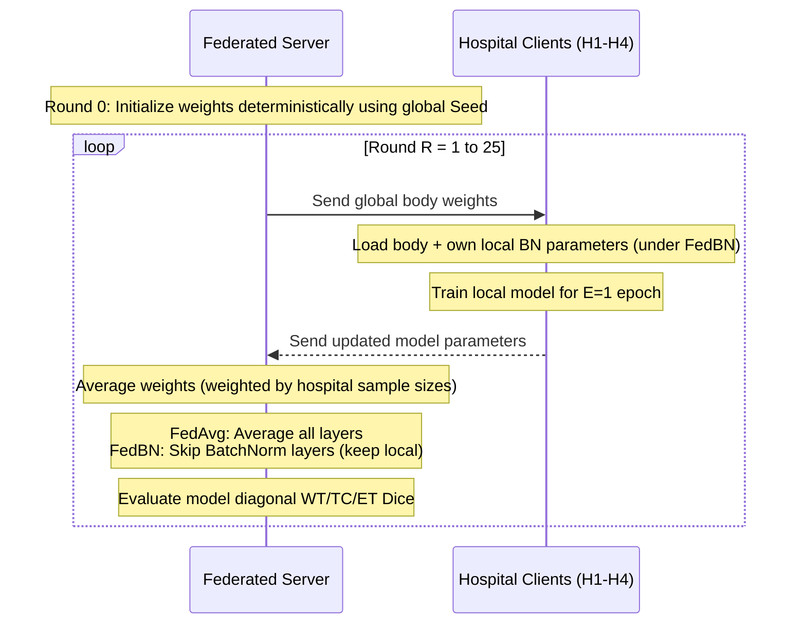

# Personalized Federated Learning for Brain Tumor Segmentation: A Comparative Study of FedAvg and FedBN

This report serves as a comprehensive reference document for advisors, guides, and teammates. It details the project background, data engineering pipeline, machine learning architectures, federated aggregation strategies, and the key findings from both the 2D and 3D backbone experiments.

---

## Executive Summary
This capstone project evaluates **Personalized Federated Learning** (specifically **FedBN**) for 3D Brain Tumor Segmentation on heterogeneous hospital datasets. We simulate a federation of 4 hospitals from the **BraTS 2021** dataset, introducing a synthetic scanner shift to create non-IID data. 

Through extensive experiments comparing **Local-only** (floor), **FedAvg** (global model), **FedBN** (personalized model), and **Centralized** (ceiling) approaches, we demonstrate a critical divergence in model performance:
- In **2D**, local personalization (FedBN) is necessary to recover outlier scanner performance because the global model collapses on anomalous data.
- In **3D**, fully collaborative training (FedAvg) is superior because data pooling acts as a powerful regularizer, mitigating local overfitting on complex volumetric networks and outperforming local personalization.

---

## 1. Background & Research Question
In medical imaging, institutions cannot easily share raw patient data due to privacy regulations (HIPAA, GDPR). **Federated Learning (FL)** allows collaborative training without pooling raw data. However, different hospitals use scanner hardware from different manufacturers, causing **domain shifts** (non-IID data). 

A single global model trained via standard **FedAvg** tries to find a compromise consensus, which often degrades performance on "outlier" clinics that deviate significantly from the group. **FedBN** addresses this by keeping Batch Normalization layers **local** to each hospital while federating only the convolutional body (weights/biases). This allows each hospital to maintain personalized normalization statistics tailored to its own scanner.

### Hypotheses Under Test
- **H1 (Collaboration Gain):** Federation improves performance on average over training local-only models.
- **H2 (Global Model Failure):** A standard global model (FedAvg) fails (underperforms local-only training) on the outlier hospital.
- **H3 (Personalization Recovery):** Keeping normalization layers local (FedBN) recovers the outlier gap from H2 while maintaining average collaboration gains.

---

## 2. Data Acquisition & Processing Pipeline

### 2.1 Storage & Drive Constraints
The **BraTS 2021** (Brain Tumor Segmentation) dataset consists of **1251 patient cases**. Each case contains 3D volumetric MRI scans across 4 modalities (`FLAIR`, `T1`, `T1ce`, `T2`) along with a ground truth segmentation mask (`0` = background, `1` = non-enhancing tumor core, `2` = peritumoral edematous tissue, `4` = GD-enhancing tumor).

The data size challenges are:
- **Compressed source:** ~13 GB.
- **Uncompressed raw data:** ~114 GB.
- **Problem:** Standard Google Colab instances offer only ~100 GB of ephemeral disk space, and free Google Drive accounts have a 15 GB storage limit.

### 2.2 Colab Stream-Unzip Solution
To solve this, we implemented a custom data-streaming pipeline in `colab_setup.ipynb`:
1. **Direct Download:** Download the zipped dataset from Kaggle directly into the Colab environment using a high-bandwidth datacenter connection.
2. **Stream-Unzip in Batches:** Extract cases in batches of **100**.
3. **Incremental Sync:** Upload each unzipped batch to a target Google Drive (or local storage), then immediately delete the local cache on Colab. This keeps the disk footprint below the limits at all times.
4. **Resumable Checks:** The script verifies existing uploads, allowing the process to resume safely after unexpected notebook disconnects.

---

## 3. Scanner Shift (Heterogeneity Simulation)

To simulate domain shift, we partition the 1251 cases into **4 hospitals** (H1, H2, H3, and H4). We apply synthetic scanner distortions to the MR modalities (segmentation masks are left untouched):

$$\text{Shifted Volume} = \left[ \left(\frac{V - V_{min}}{V_{max} - V_{min}}\right)^\gamma \times \text{Bias Field} \right] * \mathcal{G}(\sigma_{\text{blur}})$$

Where:
1. **Gamma ($\gamma$):** Simulates nonlinear contrast adjustments.
2. **Bias Field:** A smooth spatial multiplicative field simulating radiofrequency coil inhomogeneity.
3. **Gaussian Blur ($\sigma$):** Simulates scanner resolution differences.

### Calibration
H1, H2, and H3 are designated as "typical" scanners with minor shifts. **H4 is the designated outlier** with a high blur and strong bias field.

| Hospital | Gamma ($\gamma$) | Bias Amplitude | Blur Sigma ($\sigma$) | Role |
|---|---|---|---|---|
| **H1** | 1.06 | 0.06 | 0.3 | Typical |
| **H2** | 1.13 | 0.09 | 0.5 | Typical |
| **H3** | 1.20 | 0.12 | 0.7 | Typical |
| **H4** | 1.85 | 0.34 | 1.7 | **Outlier** |

---

## 4. Models & Algorithms

We use a custom, dimension-parametric wrapper (`BratsUNet`) based on the **MONAI U-Net** library:
- **Architecture:** 3 downsampling levels, 3 upsampling levels, skip connections, and residual units.
- **Input Modalities:** 4 channels (`FLAIR`, `T1`, `T1ce`, `T2`).
- **Target Regions:** 3 channels representing **nested and overlapping** segmentation tasks:
  - **WT (Whole Tumor):** Labels 1, 2, and 4 combined.
  - **TC (Tumor Core):** Labels 1 and 4 combined.
  - **ET (Enhancing Tumor):** Label 4.
- **Loss Function:** Dice + Binary Cross Entropy (BCE) using independent sigmoids per channel (multi-label, never softmax, since regions overlap).

### Backbone Hyperparameters

| Hyperparameter | 2D Backbone | 3D Backbone |
|---|---|---|
| **Input Shape** | Slice ($192 \times 192$) | Cubic Patch ($96 \times 96 \times 96$) |
| **Base Channels** | 32 (doubling to 64, 128, 256) | 16 (doubling to 32, 64, 128) |
| **Batch Size** | 8 | 1 |
| **Samples per Volume** | 8 slices per epoch | 2 patches per epoch |
| **Foreground Bias** | 70% chance of containing tumor | 70% chance of containing tumor |

---

## 5. Federated Loop and Aggregation Strategy



### FedBN Aggregation Math
Let $\theta$ represent the network weights, divided into convolutional body weights $\theta_{body}$ and Batch Normalization parameters $\theta_{BN} = \{\mu, \sigma^2, \gamma, \beta\}$.
- **FedAvg Updates:** 
  $$\theta^{t+1} = \sum_{k=1}^K \frac{N_k}{N_{total}} \theta_k^t$$
- **FedBN Updates:**
  $$\theta_{body}^{t+1} = \sum_{k=1}^K \frac{N_k}{N_{total}} (\theta_{body})_k^t$$
  $$(\theta_{BN})_k^{t+1} = (\theta_{BN})_k^t \quad (\text{No averaging for BN parameters})$$

---

## 6. Experimental Results

The results reflect testing at **Round 25** with a committed partition of **150 training cases** and **62 test cases** per hospital.

### 6.1 2D Backbone Results (WT Dice)

| Method | Mean WT | H1 WT | H2 WT | H3 WT | H4 WT (Outlier) |
|---|---|---|---|---|---|
| **Centralized (ceiling)** | 0.852 | 0.866 | 0.868 | 0.844 | 0.828 |
| **Local-only (floor)** | 0.853 | 0.848 | 0.863 | 0.842 | **0.857** |
| **FedAvg** | 0.835 | **0.883** | **0.884** | 0.838 | **0.737 (Collapse)** |
| **FedBN** | **0.852** | 0.866 | 0.866 | **0.849** | **0.829 (Recovered)** |

- **2D Verdict:** **H2 & H3 supported, H1 not.** 
  FedAvg collapses on H4 (`0.737` vs local `0.857`), dragging down the average. FedBN successfully recovers the outlier (`0.829`) and ties the centralized ceiling.

### 6.2 3D Backbone Results (WT Dice)

| Method | Mean WT | H1 WT | H2 WT | H3 WT | H4 WT (Outlier) |
|---|---|---|---|---|---|
| **Centralized (ceiling)** | 0.880 | 0.899 | 0.896 | 0.878 | 0.848 |
| **Local-only (floor)** | 0.851 | 0.871 | 0.872 | 0.844 | **0.819** |
| **FedAvg** | **0.859** | 0.862 | 0.866 | **0.859** | **0.848 (No Collapse)** |
| **FedBN** | 0.834 | 0.844 | 0.863 | 0.797 | **0.833** |

- **3D Verdict:** **H1 supported, H2 & H3 not.** 
  In 3D, FedAvg does not collapse on H4 (`0.848` vs local `0.819`). FedBN performs worse than FedAvg on both the outlier H4 (`0.833` vs `0.848`) and the average.

---

## 7. Key Scientific Insights: The 2D-vs-3D Divergence

Why did personalization (FedBN) win in 2D, while collaboration (FedAvg) won in 3D?

```
                       2D BACKBONE
                       
  H4 Slice Count is High (~12,000 slices)
       └──> Robust Estimation of Local Batch-Norm Statistics
       └──> FedBN Beats FedAvg (Outlier Recovered)
       
                       3D BACKBONE
                       
  H4 Volume Count is Low (150 volumes)
       └──> Local Batch-Norm Statistics Degenerate (Overfitting)
       └──> Pooling Data (FedAvg) acts as regularizer
       └──> FedAvg Beats FedBN & Local-Only
```

1. **Regularization Overcomes Scanner Shift in 3D:**
   A 3D U-Net is highly complex and prone to overfitting when trained locally on only 150 volumes. Under Local-only training, H4 achieves only `0.819`. By pooling data across all 4 hospitals, FedAvg acts as a powerful regularizer, helping the network learn robust volumetric structures that generalize better to the outlier H4 (`0.848`).
2. **Data Scarcity Degenerates Local BN:**
   FedBN keeps BN layers local, meaning H4 must estimate its running mean and variance solely from its 150 local volumes. In 3D, 150 volumes are statistically insufficient to calculate stable running statistics for deep convolutional layers, causing BN parameters to degenerate. In contrast, 2D training has access to ~12,000 slice views per client, which provides sufficient sample density to estimate local BN statistics accurately.

### Implication for Medical AI
When deploying models on 3D volumetric images (MRIs/CTs):
- If client data is scarce, **collaborative federated learning (FedAvg) is superior**, even in the presence of scanner shifts, because collaborative regularization is more valuable than personalization.
- Personalization strategies like **FedBN are most effective in high-sample regimes** (such as 2D slice-based workflows) where clients have enough data to calculate reliable local normalization statistics.
