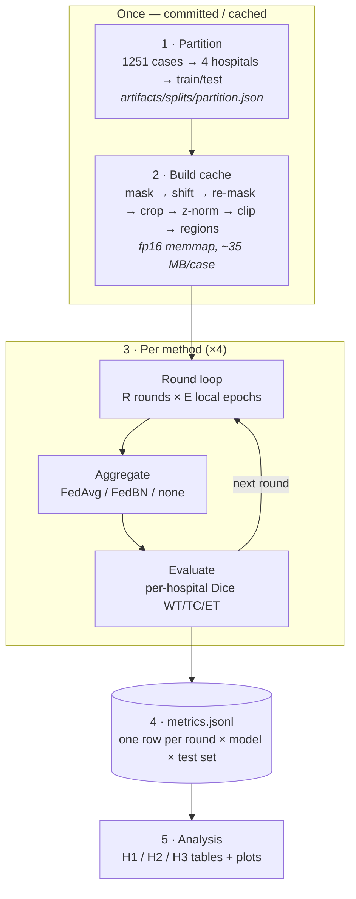
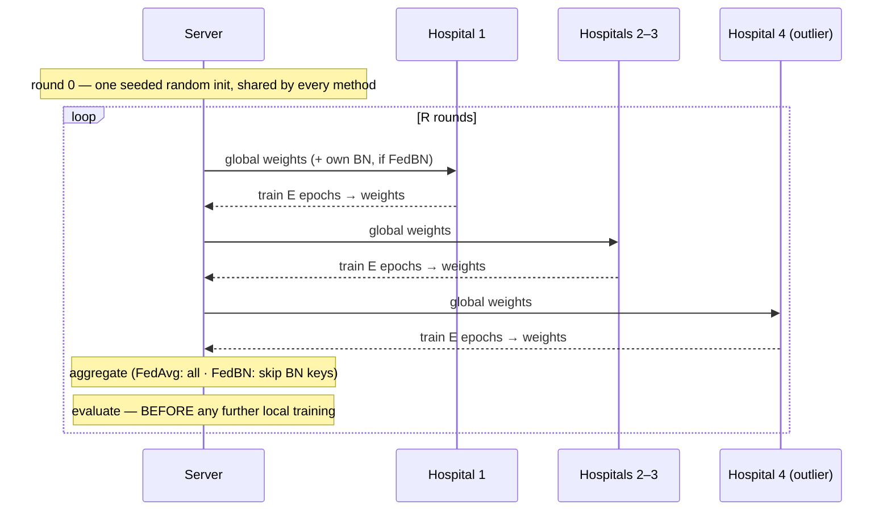

# Workflow — the full training run

What actually happens, in order, with measured costs. Read this before spending a Colab session.

Four runs over the same four hospitals, the same committed split, and the same seeded random
initialization. Only the training *procedure* differs — which is the point: it lets any difference in
Dice be attributed to federation rather than to luck or to a larger training budget.

## 1. The four runs

| Run | Trains on | What's shared | Models produced | Role |
|---|---|---|---|---|
| **E0** centralized | 600 pooled cases | — (not federated) | 1 | ceiling |
| **E1** local-only | 150 cases each | nothing | 4 | floor |
| **E2** FedAvg | 150 cases each | all weights | 1 global | tests H1, H2 |
| **E3** FedBN | 150 cases each | all **except** BatchNorm | 1 body + 4 BN sets | tests H3 |

FedBN is *not* four models. It is one shared convolutional body plus four private normalization
layers — which is why it counts as personalization and not as local-only wearing a hat.

## 2. Pipeline, end to end

Stages 1–2 run once. Stage 3 runs four times, once per method.

| # | Stage | Where | Command |
|---|---|---|---|
| 1 | Partition — deterministic, committed | any OS | `python scripts/build_partition.py` |
| 2 | Cache — resumable, key-invalidated | Colab | `python scripts/build_cache.py --max-cases 150 --workers 8` |
| 3 | Train — four methods | Colab | `python scripts/run_experiment.py --method $m --dim 2d` |
| 4 | Log — streams during (3) | Colab | → `artifacts/runs/<run_id>/metrics.jsonl` |
| 5 | Analysis | local | reads `metrics.jsonl` |

The cache directory is keyed by an md5 of the shift parameters + clip + seed, so **changing the
scanner shift automatically invalidates it** rather than silently reusing stale tensors. A dropped
Colab session resumes where it left off.

## 3. What one round does

Clients train **sequentially on one GPU**, so peak VRAM is one model regardless of K.

> **Why evaluate after aggregation and before the next round's local training.**
> This scores the *true federated model* — pure global for FedAvg, global body + own BN for FedBN.
> Score it after a round of local training instead and FedAvg quietly gains a round of local
> adaptation, which is exactly the personalization H2 claims it lacks. **H2 would vanish for a purely
> procedural reason.**

## 4. What it costs

Measured on the RTX 3050 (fp32, 2D, batch 8, 192²). T4 figures extrapolate at ~1.5× fp32 throughput.

| Quantity | Measured | Full run implies |
|---|---|---|
| Training step | **48 ms** | 600 steps/round → 0.5 min |
| Full-volume evaluation | **0.41 s / volume** | 248 volumes/round → **1.7 min** |
| Preprocess + cache one case | **2.3 s** (4 workers) | 848 cases → ≈ 33 min |
| Cache size per case | **35 MB** | 848 cases → ≈ 30 GB |
| One round (train + eval) | 2.2 min | ×25 rounds → ≈ 55 min/method |
| All four methods | ≈ 3.7 h (3050) | ≈ 2.5 h (T4) *(estimate)* |

**Evaluation costs 3.5× training.** Scoring all 62 test volumes per hospital every round dominates the
run — not the gradient steps. This is not what the design would lead you to expect.

*Lever, if the run needs to be cheaper:* evaluate a fixed 20-case subset each round and the full test
set only at the final round. Roughly halves wall-clock at the price of noisier learning curves. At
≈ 2.5 h on a T4 the full study already fits one session, so this is available, not required.

## 5. How the hypotheses get decided

Read straight off `metrics.jsonl` — nothing here is a judgement call.

| Hyp. | Claim | Test |
|---|---|---|
| **H1** | collaboration beats going alone, on average | `mean_dice(fedavg) ≥ mean_dice(local)` |
| **H2** | the global model fails the outlier | `dice(fedavg, H4) < dice(local, H4)` |
| **H3** | personalization recovers the outlier | `mean(fedbn) ≥ mean(fedavg)` **and** `dice(fedbn,H4) ≥ dice(fedavg,H4)` |

The diagonal (`model_hospital == test_hospital`) is where H1/H2/H3 live. Local-only additionally emits
a 4×4 cross-hospital matrix at the final round; its off-diagonal cells are the evidence that the shift
creates a real domain gap — **H4's model should collapse on H1–H3.**

## 6. Gates — where this can still go wrong

In order. Do not proceed past a failing gate by adding rounds.

| | Gate | What it means |
|---|---|---|
| ✅ | **Wiring smoke test** | All four methods run end to end, 2D and 3D. 18 invariants pass, including *FedBN with K=1 ≡ local-only* exactly. |
| → | **Centralized sanity** | Run E0 **first**. WT Dice should climb well past 0.7. If not, the fault is in the data pipeline or the loss — *not* federation. Debug where there is only one model. |
| ⚠ | **Does H2 appear?** | The one genuinely open parameter. If FedAvg does not underperform local-only on H4, the scanner shift is too weak: raise H4's `gamma` / `bias_amp` / `blur_sigma` in `shift.py` and rerun (the cache key changes automatically). **Fix the shift, not the code.** |
| → | **3D feasibility spike** | Memory already fits (2.06 GB at 128³/base16). *Speed* is the gate. Pass → repeat the matrix in 3D; fail → report the spike, 2D stands as the deliverable. |
| → | **NVIDIA FLARE port** *(optional, last)* | Same aggregation math, different orchestration. Linux/Colab only. After the science is settled — never the sole way to reproduce a result. |

## 7. Direction check

Settled:

- **K = 4** hospitals, H4 the outlier; split committed and frozen.
- **150 train cases per hospital** (of ~251); all **62** test cases used.
- **R = 25 rounds, E = 1** local epoch. Local-only and centralized get the same 25 epochs
  ([matched compute](experiments.md#3-how-each-hypothesis-is-measured)).
- **2D now, 3D behind a feasibility gate.** One cache serves both — it stores volumes, not
  pre-sampled slices.
- **The custom loop produces the results.** FLARE is a later demonstration, not a dependency.

Still guesses, worth interrogating before the cache build:

- **`R = 25`** was chosen before we had seen a single learning curve.
- **`train_per_hospital = 150`** is justified by reasoning ("keep the H1 benefit visible"), not evidence.
  If H1 comes out weak, raising the cap toward 251 makes it *weaker*; lowering it toward ~80 sharpens it.
- **Shift strength is provisional** — H4's outlier margin is +0.149 σ after z-normalization. Whether
  that suffices is answered empirically by gate 3.
