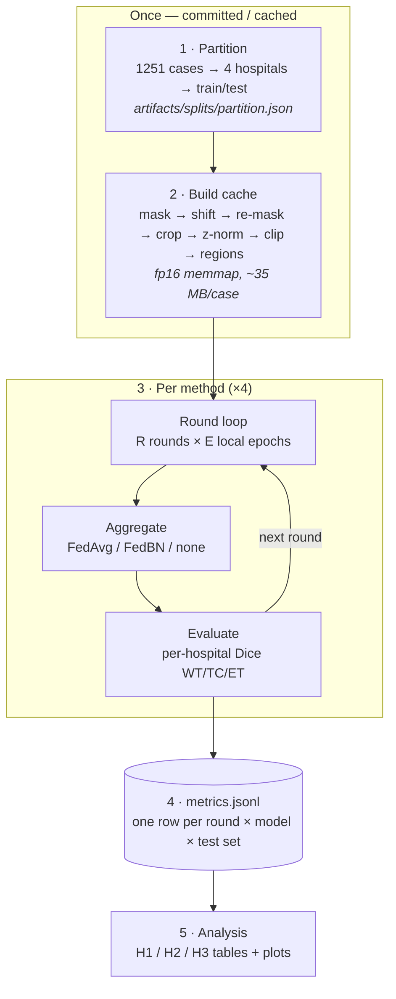
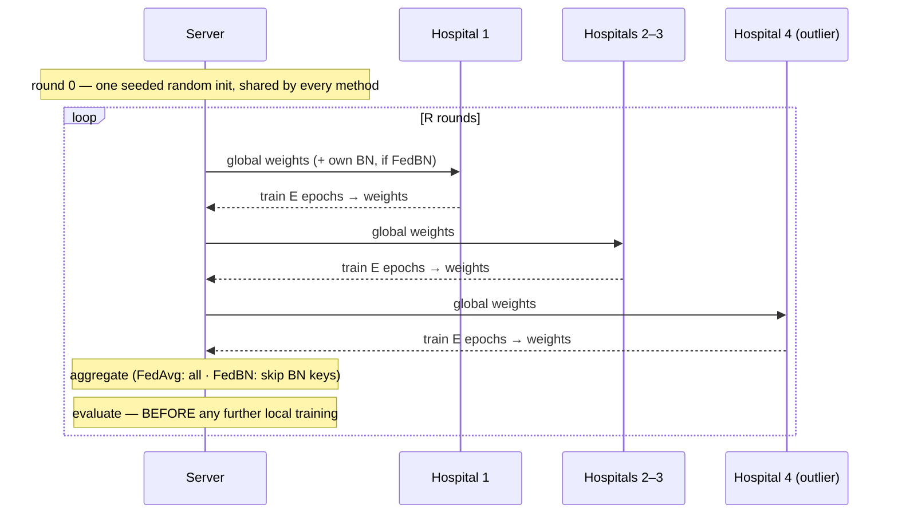

# Workflow — the full training run

What actually happens, in order, with measured costs. Read this before spending a Colab session.

Four runs over the same four hospitals, the same committed split, and the same seeded random
initialization. Only the training *procedure* differs — which is the point: it lets any difference in
Dice be attributed to federation rather than to luck or to a larger training budget.

## 1. The four runs

Hospitals are **Site A–D** in prose (`H1`–`H4` in code and logs; **Site D** is the outlier) —
see [conventions.md](conventions.md). Case counts below are for the current `--preset v5`;
the v1 baseline used 150 per site and 600 pooled.

| Run | Trains on | What's shared | Models produced | Role |
|---|---|---|---|---|
| **E0** centralized | 920 pooled cases | — (not federated) | 1 | ceiling |
| **E1** local-only | 230 cases each | nothing | 4 | floor |
| **E2** FedAvg | 230 cases each | all weights | 1 global | tests H1, H2 |
| **E3** FedBN | 230 cases each | all **except** BatchNorm | 1 body + 4 BN sets | tests H3 |

FedBN is *not* four models. It is one shared convolutional body plus four private normalization
layers — which is why it counts as personalization and not as local-only wearing a hat.

## 2. Pipeline, end to end

Stages 1–2 run once. Stage 3 runs four times, once per method.


```mermaid
flowchart TD
    subgraph ONCE["Once — committed / cached"]
        P["1 · Partition<br/>1251 cases → 4 hospitals → train/test<br/><i>artifacts/splits/partition.json</i>"]
        C["2 · Build cache<br/>mask → shift → re-mask → crop → z-norm → clip → regions<br/><i>fp16 memmap, ~35 MB/case</i>"]
        P --> C
    end

    subgraph EACH["3 · Per method (×4)"]
        T["Round loop<br/>R rounds × E local epochs"]
        A["Aggregate<br/>FedAvg / FedBN / none"]
        E["Evaluate<br/>per-hospital Dice WT/TC/ET"]
        T --> A --> E
        E -->|next round| T
    end

    C --> T
    E --> M[("4 · metrics.jsonl<br/>one row per round × model × test set")]
    M --> H["5 · Analysis<br/>H1 / H2 / H3 tables + plots"]
```

| # | Stage | Where | Command |
|---|---|---|---|
| 1 | Partition — deterministic, committed | any OS | `python scripts/build_partition.py` |
| 2 | Cache — resumable, key-invalidated | Colab | `python scripts/build_cache.py --max-cases 250 --workers 8` |
| 3 | Train — four methods | Colab | `python scripts/run_matrix.py --dim 2d --seed 42 --preset v5 --tag v5` |
| 4 | Log — streams during (3) | Colab | → `artifacts/runs/<run_id>/metrics.jsonl` |
| 5 | Analysis | local | reads `metrics.jsonl` |

The cache directory is keyed by an md5 of the shift parameters + clip + seed, so **changing the
scanner shift automatically invalidates it** rather than silently reusing stale tensors. A dropped
Colab session resumes where it left off.

## 3. What one round does


```mermaid
sequenceDiagram
    participant S as Server
    participant H1 as Hospital 1
    participant H23 as Hospitals 2–3
    participant H4 as Hospital 4 (outlier)
    Note over S: round 0 — one seeded random init, shared by every method
    loop R rounds
        S->>H1: global weights (+ own BN, if FedBN)
        H1-->>S: train E epochs → weights
        S->>H23: global weights
        H23-->>S: train E epochs → weights
        S->>H4: global weights
        H4-->>S: train E epochs → weights
        Note over S: aggregate (FedAvg: all · FedBN: skip BN keys)
        Note over S: evaluate — BEFORE any further local training
    end
```

Clients train **sequentially on one GPU**, so peak VRAM is one model regardless of K.

> **Why evaluate after aggregation and before the next round's local training.**
> This scores the *true federated model* — pure global for FedAvg, global body + own BN for FedBN.
> Score it after a round of local training instead and FedAvg quietly gains a round of local
> adaptation, which is exactly the personalization H2 claims it lacks. **H2 would vanish for a purely
> procedural reason.**

## 4. What it costs

Measured on the RTX 3050 (fp32, 2D, batch 8, 192²). T4 figures extrapolate at ~1.5× fp32 throughput.

| Quantity | Measured | Full run implies |
|---|---|---|
| Training step | **48 ms** | 600 steps/round → 0.5 min |
| Full-volume evaluation | **0.41 s / volume** | 248 volumes/round → **1.7 min** |
| Preprocess + cache one case | **2.3 s** (4 workers) | 848 cases → ≈ 33 min |
| Cache size per case | **35 MB** | 848 cases → ≈ 30 GB |

**Evaluation costs 3.5× training.** Scoring all 62 test volumes per hospital every round dominates the
run — not the gradient steps. This is not what the design would lead you to expect.

### End-to-end, from the run logs (not extrapolated)

The component timings above predict 2.2 min/round. The completed runs took **4.0–4.7**, so budget
from these rather than from the microbenchmarks — the gap is per-case memmap I/O and Python
overhead that a warm single-operation probe does not see.

| 2D run (R=25, seed 42) | Wall clock | min/round |
|---|---|---|
| centralized | 117 min | 4.67 |
| local-only | 114 min | 4.55 |
| FedAvg | 104 min | 4.16 |
| FedBN | 98 min | 3.94 |
| **all four** | **7.2 h** on the 3050 | — |

### Measured cost per iteration

| Iteration | Scope | Wall clock |
|---|---|---|
| v1 | 2D matrix, seed 42 | 7.2 h |
| v3 | 2D + 3D, seed 42 | 33 h |
| **v5** | 2D + 3D, seed 42 | **~44 h** |

v5 trains 40 rounds instead of 25 and 230 cases/site instead of 150, but pays for part of that with
two evaluation changes: `eval_test_every=3` scores the full test set on 17 of 40 rounds rather than
all of them (the estimator's own rounds are always scored), and larger inference batches
(`eval_batch_size=64`, `sw_batch_size=4`) make the forward pass **2.7× faster in 2D and 6.9× in
3D** while leaving per-case Dice within 1.5e-4.

*Where the time actually goes:* for 2D FedBN a round is ~48 % training and ~52 % evaluation. A
larger **training** batch would not help in 2D — training runs at 195 ms/step against a 48 ms GPU
step, so most of it is data loading. 3D is the opposite, genuinely GPU-bound at `batch_size=1`, and
is the place to spend spare VRAM next.

## 5. How the hypotheses get decided

Read straight off `metrics.jsonl` — nothing here is a judgement call.

| Hyp. | Claim | Test |
|---|---|---|
| **H1** | collaboration beats going alone, on average | `mean_dice(fedavg) ≥ mean_dice(local)` |
| **H2** | the global model fails the outlier | `dice(fedavg, Site D) < dice(local, Site D)` |
| **H3** | personalization recovers the outlier | `mean(fedbn) ≥ mean(fedavg)` **and** `dice(fedbn, Site D) ≥ dice(fedavg, Site D)` |

The diagonal (`model_hospital == test_hospital`) is where H1/H2/H3 live. Local-only additionally emits
a 4×4 cross-hospital matrix at the final round; its off-diagonal cells are the evidence that the shift
creates a real domain gap — **Site D's model should collapse on Sites A–C.**

## 6. Gates — where this can still go wrong

In order. Do not proceed past a failing gate by adding rounds.

| | Gate | What it means |
|---|---|---|
| ✅ | **Wiring smoke test** | All four methods run end to end, 2D and 3D. 18 invariants pass, including *FedBN with K=1 ≡ local-only* exactly. |
| → | **Centralized sanity** | Run E0 **first**. WT Dice should climb well past 0.7. If not, the fault is in the data pipeline or the loss — *not* federation. Debug where there is only one model. |
| ⚠ | **Does H2 appear?** | The one genuinely open parameter. If FedAvg does not underperform local-only on Site D, the scanner shift is too weak: raise Site D's `gamma` / `bias_amp` / `blur_sigma` in `shift.py` and rerun (the cache key changes automatically). **Fix the shift, not the code.** |
| ✅ | **3D feasibility spike** | Memory already fits (2.06 GB at 128³/base16). 3D training is COMPLETE, full matrix completed. |
| → | **NVIDIA FLARE port** *(optional, last)* | Same aggregation math, different orchestration. Linux/Colab only. After the science is settled — never the sole way to reproduce a result. |

## 7. Direction check

Settled:

- **K = 4** hospitals, Site D the outlier; split committed and frozen.
- **230 train + 20 validation cases per hospital** under v5 (of ~251); all **62** test cases used.
  v1 used 150 and no validation set.
- **R = 40 rounds (v5), E = 1** local epoch, cosine annealing to its floor by round 25.
  Local-only and centralized get the same R epochs
  ([matched compute](experiments.md#3-how-each-hypothesis-is-measured)).
- **2D and 3D completed.** One cache serves both — it stores volumes, not
  pre-sampled slices.
- **The custom loop produces the results.** FLARE is a later demonstration, not a dependency.

Still guesses, worth interrogating before the cache build:

- **`R = 25`** was chosen before we had seen a single learning curve.
- **`train_per_hospital = 150`** is justified by reasoning ("keep the H1 benefit visible"), not evidence.
  If H1 comes out weak, raising the cap toward 251 makes it *weaker*; lowering it toward ~80 sharpens it.
- **Shift strength is provisional** — H4's outlier margin is +0.149 σ after z-normalization. Whether
  that suffices is answered empirically by gate 3.

## 8. Reruns and before/after comparison

Every default above still reproduces the frozen v1 baseline. Improvements are opt-in and land in a
separate directory, so earlier results survive the rerun that supersedes them.

```bash
python scripts/freeze_baseline.py                             # snapshot + SHA-256 what exists
python scripts/build_cache.py --max-cases 250 --workers 8     # 230 train + 20 val (resumable)
python scripts/run_matrix.py --dim 2d 3d --seed 42 --preset v5 --tag v5
python scripts/compare_runs.py --baseline artifacts/snapshots/v1 --new artifacts/runs/v5        --dim 2d --seed 42 --select last-k --last-k 5
python scripts/check_docs.py                                  # docs still match the logs
```

| Flag | Effect |
|---|---|
| *(none)* | the v1 baseline recipe, bit-reproducible |
| `--preset v5` | **current best** — 40 rounds annealing by 25, geometric augmentation, TTA, component filtering, validation-based selection, 230 cases/hospital |
| `--tag v5` | writes to `artifacts/runs/v5/<run_id>/` instead of `artifacts/runs/<run_id>/` |

`--preset v2` and `--preset v4` still exist but **should not be used** — both regressed, and are
retained only as evidence. See [iteration-report.md](iteration-report.md) §8.

**Reruns without a tag are refused, not appended.** `metrics.jsonl` is opened in append mode and
`run_id` carries no run counter, so a second run of the same method+seed would have written its
rounds underneath the first's inside one file — and `analyze.py`, which scores `max(round)`, would
have averaged two experiments into one number with nothing in the output to show for it.

`run_matrix.py` is resumable: it skips any run that already wrote `summary.json`, so an interrupted
sweep is restarted with the same command.

Full rationale, the evaluation-noise finding behind `--select last-k`, and what the comparison
reports: [`iteration-report.md`](iteration-report.md) and [`improvements.md`](improvements.md).

## 9. Additional Steps
- **Step: Launch Web Demo** — `uv run python scripts/demo_server.py` → opens at http://localhost:8000
- **Step: Run Tests** — `uv run python -m pytest tests/ -v` → 44 tests
